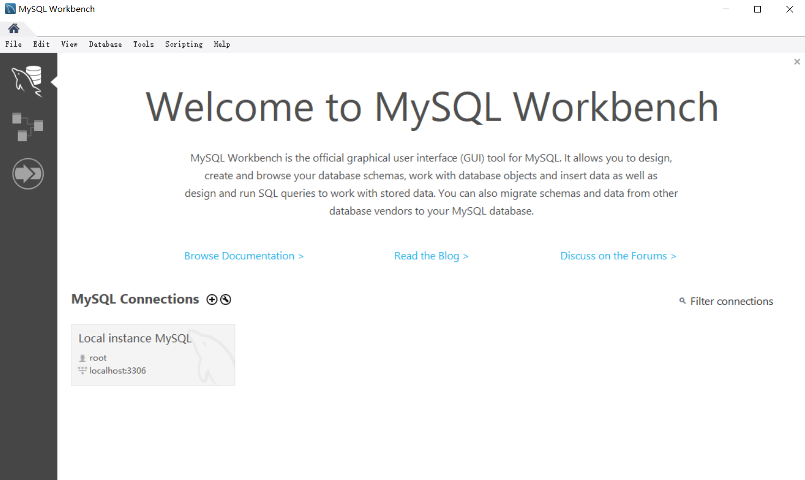

# MySQL学习笔记      task1
---
---
## 1.1 MySQL 软件安装及数据库基础

### 1.1.1 软件的安装

_<font size="2">软件安装参考[菜鸟教程](https://www.runoob.com/mysql/mysql-install.html
)</font>_</br>

在[此链接](https://dev.mysql.com/downloads/mysql/
)内找到相应的版本进行下载。


<p>这里采用Windows (x86, 64-bit)版本进行下载安装。MySQL版本号为8.0.17。
</p>

&#8195;&#8195;点击 Download 按钮进入下载页面，点击下图中的 No thanks, just start my download.
<p></p>

&#8195;&#8195;将下载的文件解压后放在适当的位置（_路径中最好不要包括中文_),这里将文件解压至`E:\program files\mysql-8.0.17-winx64`。
&#8195;&#8195;在`E:\program files\mysql-8.0.17-winx64`文件夹下创建文本文件并重命名为`my.ini`，打开该配置文件并粘贴如下配置信息：
```
[client]
# 设置mysql客户端默认字符集
default-character-set=utf8
 
[mysqld]
# 设置3306端口
port = 3306
# 设置mysql的安装目录
basedir=E:\\program files\\mysql-8.0.17-winx64
# 设置 mysql数据库的数据的存放目录，MySQL 8+ 不需要以下配置，系统自己生成即可，否则有可能报错
#datadir=E:\\practice\\mysql
# 允许最大连接数
max_connections=20
# 服务端使用的字符集默认为8比特编码的latin1字符集
character-set-server=utf8
# 创建新表时将使用的默认存储引擎
default-storage-engine=INNODB
```

将路径`E:\program files\mysql-8.0.17-winx64\bin`加入环境变量。

按Windows徽标键输入cmd搜索到cmd，右键以管理员身份运行。

初始化数据库：
```
mysqld --initialize --console
```
&#8195;执行完成后，会输出 root 用户的初始默认密码，`A temporary password is generated for root@localhost:`后的字符串即为默认密码，记下密码。
然后需要输入以下命令将MySQL安装为Windows服务：
```mysqld install```
启动MySQL：
```mysqld install```

这里为方便学习，将该数据库密码改为简单的数字：
```mysqladmin -u root -p password 123```
_<font size="2">password处为初始密码，123即为更改后的密码</font>_

在命令行中输入`mysql -uroot -p`,出现`Enter password:`后输入密码，即可登录MySQL。
>MySQL命令的一些参数：
>* -h : 指定客户端所要登录的 MySQL 主机名, 登录本机(localhost 或 127.0.0.1)该参数可以省略;
>* -h : 指定客户端所要登录的 MySQL 主机名, 登录本机(localhost 或 127.0.0.1)该参数可以省略;
>* -p : 告诉服务器将会使用一个密码来登录, 如果所要登录的用户名密码为空, 可以忽略此选项。

登陆成功后命令行变为：
```mysql>```
此时即可输入SQL语句（_MySQL中的SQL语句以分号结尾_）
在`mysql>`后输入`\q`即可退出当前数据库。

---
### 1.1.2 图形化管理工具的使用
_<font size='2' color='green'>考虑到Navicat for MySQL为商业软件且破解版可能具有的潜在风险，这里采用开源软件MySQL workbench</font>_

MySQL workbench的下载
_参考[这篇文章](https://blog.csdn.net/weixin_42350428/article/details/81669022
)_
从MySQL workbench[官方网站](https://dev.mysql.com/downloads/workbench/
)下载MySQL workbench。

点击下图所示`Download`按钮：


&#8195;选择no thanks，just download：


&#8195;采用默认设置安装即可（_这里将安装位置改为`E:\program files\mysql_workbench_8`_）
 

&#8195;点击local instance，输入密码后即可打开workbench的工作台：

&#8195;在主窗口敲入mysql命令，点击闪电图标就可以运行命令了，运行命令的结果就在下面的results，闪电执行多行，闪电1执行选定行 ：


<style> 
    .bor{border:2px solid #808080;
    border-radius:10px;
    box-shadow:2px 2px 5px 0 black; } 
</style> 
<div class="bor">
&#8195;MySQL workbench查看表间关系的方法：</br>
&#8195;左上角小房子键回到主界面：</br>

&#8195;选择>选第一个选项，然后一路next到底，中途看到book数据库打勾 </br>

&#8195;然后就可以看到结果了。</br>

</div> 

---
### 1.1.3 数据库基础知识
+ 数据库定义
  所謂「資料庫」係以一定方式储存在一起、能予多个用户共享、具有尽可能小的冗余度、与应用程序彼此独立的数据集合。一个数据库由多个表空间（Tablespace）构成。(_来自维基百科_)

+ 关系型数据库
 关系数据库（英语：Relational database），是建立在关系模型基础上的数据库，借助于集合代数等数学概念和方法来处理数据库中的数据。现实世界中的各种实体以及实体之间的各种联系均用关系模型来表示。关系模型是由埃德加·科德于1970年首先提出的
+ 二维表 
表（table）是某种特定类型数据的结构化清单。 
+ 列（column）
 表中的一个字段。所有表都是由一个或多个列组成的
+ 行（row） 
 表中的一个记录。 
+ 主键（primary key） 一列（或一组列），其值能够唯一标识表中每一行。
+ 外键（foreign key）
如果公共关键字在一个关系中是主关键字，那么这个公共关键字被称为另一个关系的外键。

_<font size='2' color='green'>&#8195;&#8195;外键将不同的表联系起来，从而实现不同数据存储在不同的表中，减少了数据的冗余,使数据库的伸缩性好（scale well），能够适应不断增加的工作量而不失败。</font>_
<table>
  <tbody>
    <tr>
      <td style="vertical-align:top;">
        <p>&nbsp;</p>
      </td>
      <td style="vertical-align:top;">
        <p>主键</p>
      </td>
      <td style="vertical-align:top;">
        <p>外键</p>
      </td>
    </tr>
    <tr>
      <td style="vertical-align:top;">
        <p>定义：</p>
      </td>
      <td style="vertical-align:top;">
        <p>唯一标识一条记录，不能有重复的，不允许为空</p>
      </td>
      <td style="vertical-align:top;">
        <p>表的外键是另一表的主键,&nbsp;外键可以有重复的,&nbsp;可以是空值</p>
      </td>
    </tr>
    <tr>
      <td style="vertical-align:top;">
        <p>作用：</p>
      </td>
      <td style="vertical-align:top;">
        <p>用来保证数据完整性</p>
      </td>
      <td style="vertical-align:top;">
        <p>用来和其他表建立联系用的</p>
      </td>
    </tr>
    <tr>
      <td style="vertical-align:top;">
        <p>个数：</p>
      </td>
      <td style="vertical-align:top;">
        <p>主键只能有一个</p>
      </td>
      <td style="vertical-align:top;">
        <p>一个表可以有多个外键</p>
      </td>
    </tr>
  </tbody>
</table>

### 1.1.4 MySQL数据库管理系统
+ 数据库是一些关联表的集合。
+ 数据表: 表是数据的矩阵。在一个数据库中的表看起来像一个简单的电子表格。
+ 视图<font size='0.1' color ='#CD6600'>《SQL必知必会》159页第十八课 </font>
视图是从一个或几个基本表（或视图）中导出的虚拟的表。
视图是原始数据库数据的一种变换，是查看表中数据的另外一种方式。，


*MySQL中视图的使用：*
测试表:user有id，name，age，sex字段
测试表:goods有id，name，price字段
测试表:ug有id，userid，goodsid字段
视图的创建：
```SQL
CREATE VIEW other AS
SELECT a.name AS username, b.name AS goodsname
FROM user a, goods b, ug c
WHERE a.id = c.userid
	AND c.goodsid = b.id;
```
视图other可以获取user的username和goods的name。

视图的删除：
```sql
DROP VIEW viewname;
```
*更新视图时，必须先删除旧的视图，再创建新的视图*
>视图的优点有：
1.视图可以实现查询语句的复用(类似定义了一个函数)
2.可以实现对数据的保护。
3.可以对选择出的数据进行格式化。
4.过滤特定的数据。

+ 存储过程
存储过程就是为以后使用而保存的一条或多条SQL语句。可将其视为增强版的批处理文件。存储过程被事先编译好存放于当前数据库中，以便调用时快速执行。


```sql
DELIMITER $$ 
DELIMITER; 
```
用来定义分隔符，因为MySQL默认以";"为分隔符，如果我们没有声明分割符，那么编译器会把存储过程当成SQL语句进行处理，则存储过程的编译过程会报错，所以要事先用DELIMITER关键字申明当前段分隔符，这样MySQL才会将";"当做存储过程中的代码，不会执行这些代码，用完了之后要把分隔符还原。


存储过程的调用：
```sql
call 存储过程名(参数一,参数二);
```
判断语句（if else）：
```sql
begin
    if 条件 then
      语句;
    elseif 条件2 then
        语句2;
    else 语句3;
    end if;
end$$
```
判断语句（case）：
```sql
DELIMITER $$  
CREATE PROCEDURE proc3 (in          parameter int)  
begin 
    declare var int;  
    set var=parameter+1;  
    case var  
    when 0 then   
        insert into t values(17); 
    when 1 then   
        insert into t values(18); 
    else   
         insert into t values(19);  
    end case;  
end$$
DELIMITER ;
```
变量声明：
```sql
declare 变量名 数据类型;
```
数据类型包括 `int`,`decimal(8,2)`等。

循环语句（while）:
```sql
mysql > DELIMITER //  
mysql > CREATE PROCEDURE proc4()  
    -> begin 
    -> declare var int;  
    -> set var=0;  
    -> while var<6 do  
    -> insert into t values(var);  
    -> set var=var+1;  
    -> end while;  
    -> end//  
mysql > DELIMITER ;
```
循环语句（repeat）：
```sql
mysql > DELIMITER //  
mysql > CREATE PROCEDURE proc5 ()  
    -> begin   
    -> declare v int;  
    -> set v=0;  
    -> repeat  
    -> insert into t values(v);  
    -> set v=v+1;  
    -> until v>=5  
    -> end repeat;  
    -> end;  
    -> //  
mysql > DELIMITER ;
```
针对求《SQL必知必会》所给数据中价格最大值的一个存储过程的例子:
```sql

drop procedure if exists `max_price`;
delimiter $$--临时改变分割符
use tysql$$
create procedure `maxp`(
	out max_price decimal(8,2))--创建
begin 
	select AVG(prod_price) 
    into max_price
    from products;
end$$
delimiter ;

call maxp(@pricemax);
select @pricemax;
```
存储过程的创建：
```sql
　CREATE PROCEDURE([[IN |OUT |INOUT ] 参数名 数据类形...])
```
存储过程的删除：
```sql
drop procedure if exists `存储过程名`
```
_注意存储过程名字必须用反单引号`而不是单引号‘_

---
---
## 1.2 MySQL 基础 （一）- 查询语句
### （1）导入数据库
#### 方法一
_<font size="2">数据导入参考[MySQL导入示例数据库](https://www.yiibai.com/mysql/how-to-load-sample-database-into-mysql-database-server.html
)</font>_</br>
下载易百教程示例数据库解压后放到桌面，以管理员身份运行cmd，输入：
```
mysql -u root -p
```
输入密码进入数据库。
再运行：
```sql
CREATE DATABASE IF NOT EXISTS yiibaidb DEFAULT CHARSET utf8 COLLATE utf8_general_ci;
use yiibaidb;
source C:/Users/me/Desktop
```
_注意source 后的路径中用斜杠"/" 而不是反斜杠"\"_
可以继续输入:
```sql
select city,phone,country from `offices`;
```
检验是否导入成功。
若导入成功，则输出：
```
+---------------+------------------+-----------+
| city          | phone            | country   |
+---------------+------------------+-----------+
| San Francisco | +1 650 219 4782  | USA       |
| Boston        | +1 215 837 0825  | USA       |
| NYC           | +1 212 555 3000  | USA       |
| Paris         | +33 14 723 4404  | France    |
| Beijing       | +86 33 224 5000  | China     |
| Sydney        | +61 2 9264 2451  | Australia |
| London        | +44 20 7877 2041 | UK        |
+---------------+------------------+-----------+
7 rows in set (0.00 sec)
```
#### 方法二
打开MySQL workbench并连接数据库，按快捷键`ctrl+shift+o`选择`yiibaidb.sql`脚本，然后执行该脚本，即可导入数据。

_因为我学习过程中主要参考《sql必知必会》，故导入了该书附带数据。导入方法详见`TeachYourselfSQL_MySQL.zip`中的`readme.pdf`_
### （2） SQL、MySQL是什么？
SQL代表结构化查询语言(Structured Query Language)。SQL是用于访问数据库的标准化语言。
SQL包含三个部分：

* 数据定义语言包含定义数据库及其对象的语句，例如表，视图，触发器，存储过程等。
* 数据操作语言包含允许您更新和查询数据的语句。
* 数据控制语言允许授予用户权限访问数据库中特定数据的权限。
</br>
My是MySQL的联合创始人 - Monty Widenius 的女儿的名字。MySQL是My和SQL的组合，这就是MySQL命名的由来。
MySQL是一个数据库管理系统（DBMS）,是由Oracle支持的开源软件。


### （3）SELECT FROM
该语句用于检索信息

关键字 `DISTINCT`:可去掉结果中的相同值，放在列名之前。
distinct必须放在开头，否则会报错。
错误示例：
>~~select id, distinct name from A;~~

`LIMIT`子句和`OFF SET`子句，可检索出特定项数据
```sql
SELECT prod_name
FROM Products 
LIMIT 5 
OFFSET 5; 
```
LIMIT 5 OFFSET 5 指示 MySQL等 DBMS返回从第 5行起的 5行数据。 第一个数字是检索的行数，第二个数字是指从哪儿开始。
`LIMIT 0,N`可取到前n个数据。
判断子句 case...wehen...then...end 的用法：
* 简单Case函数：
```sql
case 列名
    when   条件值1  then  选择项1
    when   条件值2  then  选择项2
    else    默认    end
```
* Case搜索函数
```sql
case  
    when  判断条件1 then  选择项1
    when  判断条件2  then  选择项2
    else    默认值  end
```

### （4）WHERE 
在 SELECT 语句中，数据根据 WHERE 子句中指定的搜索条件进行过滤。 
WHERE 子句在表名（FROM 子句）之后给出
例如：
```sql
SELECT prod_name, prod_price 
FROM Products 
WHERE prod_price = 3.49;  
```


|通配符|特点|
|---|---|
百分号%(或*)  |表示任何字符出现任意次数
下划线_  |只匹配单个字符
方括号[]|匹配一个字符集中的一个字符
_此通配符可以用前缀字符^（脱字号）来否定。_

<table align="left" class="reference notranslate" style="height: 360px; width: 647px; border: 1px solid #a52a2a; background-color: #f0f8ff;" border="1" rules="all" frame="border">
<tbody>
<tr>
<td style="text-align: center;">逻辑运算符（操作符）</td>
<td style="text-align: center;">描述</td>
</tr>
<tr>
<td style="text-align: center;">&nbsp; &nbsp;AND &nbsp; &nbsp;</td>
<td>AND 运算符允许在一个 SQL 语句的 WHERE 子句中的多个条件的存在。</td>
</tr>
<tr>
<td style="text-align: center;">&nbsp;BETWEEN&nbsp;</td>
<td>BETWEEN 运算符用于在给定最小值和最大值范围内的一系列值中搜索值。</td>
</tr>
<tr>
<td style="text-align: center;">EXISTS</td>
<td>EXISTS 运算符用于在满足一定条件的指定表中搜索行的存在。</td>
</tr>
<tr>
<td style="text-align: center;">IN</td>
<td>IN 运算符用于把某个值与一系列指定列表的值进行比较。</td>
</tr>
<tr>
<td style="text-align: center;">NOT IN</td>
<td>IN 运算符的对立面，用于把某个值与不在一系列指定列表的值进行比较。</td>
</tr>
<tr>
<td style="text-align: center;">LIKE</td>
<td>LIKE 运算符用于把某个值与使用通配符运算符的相似值进行比较。</td>
</tr>
<tr>
<td style="text-align: center;">&nbsp;GLOB &nbsp; &nbsp;&nbsp;</td>
<td>GLOB 运算符用于把某个值与使用通配符运算符的相似值进行比较。GLOB 与 LIKE 不同之处在于，它是大小写敏感的。</td>
</tr>
<tr>
<td style="text-align: center;">NOT</td>
<td>NOT 运算符是所用的逻辑运算符的对立面。比如 NOT EXISTS、NOT BETWEEN、NOT IN，等等。它是否定运算符。</td>
</tr>
<tr>
<td style="text-align: center;">OR</td>
<td>OR 运算符用于结合一个 SQL 语句的 WHERE 子句中的多个条件。</td>
</tr>
<tr>
<td style="text-align: center;">IS NULL</td>
<td>NULL 运算符用于把某个值与 NULL 值进行比较。</td>
</tr>
<tr>
<td style="text-align: center;">IS</td>
<td>IS 运算符与 = 相似。</td>
</tr>
<tr>
<td style="text-align: center;">IS NOT</td>
<td>IS NOT 运算符与 != 相似。</td>
</tr>
<tr>
<td style="text-align: center;">||</td>
<td>连接两个不同的字符串，得到一个新的字符串。</td>
</tr>
<tr>
<td style="text-align: center;">UNIQUE</td>
<td>UNIQUE 运算符搜索指定表中的每一行，确保唯一性（无重复）。</td>
</tr>
</tbody>
</table>

<table align="left" style="height: 132px; width: 634px; border: 1px solid #ed1153; background-color: #f0f8ff;" border="1">
<tbody>
<tr>
<td style="text-align: center;">算数运算符</td>
<td style="text-align: center;">描述</td>
</tr>
<tr>
<td style="text-align: center;">+</td>
<td>加法 - 把运算符两边的值相加</td>
</tr>
<tr>
<td style="text-align: center;">-</td>
<td>减法 - 左操作数减去右操作数</td>
</tr>
<tr>
<td style="text-align: center;">*</td>
<td>乘法 - 把运算符两边的值相乘</td>
</tr>
<tr>
<td style="text-align: center;">/</td>
<td>除法 - 左操作数除以右操作数</td>
</tr>
<tr>
<td style="text-align: center;">%</td>
<td>取模 - 左操作数除以右操作数后得到的余数</td>
</tr>
</tbody>
</table>

默认下，and优先级高于or
_任何时候使用具有 AND 和 OR 操作符的 WHERE 子句，都应该使用圆括 号明确地分组操作符。_

### （5）GROUP BY
group by可以将数据分为多个逻辑组，再*对每个组进行聚集计算。*
***注意，先分组，再聚集计算***
例：
```sql
SELECT vend_id, COUNT(*) AS num_prods 
FROM Products 
GROUP BY vend_id; 
```
***除聚集计算语句外，SELECT 语句中的每一列都必须在 GROUP BY 子句 中给出。否则会报错***

having 子句除可以过滤分组外，其余用法与where类似。
### （6）ORDER BY 
该子句用于排序，可以按照单个列和多个列进行排序，该子句必须是select的最后一个子句，否则报错。
默认排序方式是升序排序，`ORDER BY 列名 DESC`可以实现降序排序
### （7）函数
时间函数|功能
|---|---|
sysdate()|动态得到日期时间
now()|一执行就得到时间值
curdate()|当前日期
extract()|抽取日期时间各个部分

数值函数|功能
|---|---|
ABS()|返回一个数的绝对值 
COS() |返回一个角度的余弦 
EXP() |返回一个数的指数值 
PI() |返回圆周率 SIN()| 返回一个角度的正弦 
SQRT() |返回一个数的平方根 


字符串函数|功能
|---|---|
ascii(str)|返回字符串str的第一个字符的ascii值(str是空串时返回0) 
bin(n)|把n转为二进制值并以字串返回
length(str)|返回字符串str的长度
left(str,len)|返回字符串str的左端len个字符 
**MySQL 函数速查表**
<table class="table" border="1" summary="mysql函数大全">
<thead>
<tr><th scope="col"><span style="font-size: 18px; font-family: 'Microsoft YaHei';">名称</span></th><th scope="col"><span style="font-size: 18px; font-family: 'Microsoft YaHei';">描述</span></th></tr>
</thead>
<tbody>
<tr>
<td><span style="font-size: 18px; font-family: 'Microsoft YaHei';"><code class="literal">ABS()</code></span></td>
<td><span style="font-size: 18px; font-family: 'Microsoft YaHei';">返回绝对值</span></td>
</tr>
<tr>
<td><span style="font-size: 18px; font-family: 'Microsoft YaHei';"><code class="literal">ACOS()</code></span></td>
<td><span style="font-size: 18px; font-family: 'Microsoft YaHei';">返回反余弦</span></td>
</tr>
<tr>
<td><span style="font-size: 18px; font-family: 'Microsoft YaHei';"><code class="literal">ADDDATE()</code></span></td>
<td><span style="font-size: 18px; font-family: 'Microsoft YaHei';">将时间值（间隔）添加到日期值</span></td>
</tr>
<tr>
<td><span style="font-size: 18px; font-family: 'Microsoft YaHei';"><code class="literal">ADDTIME()</code></span></td>
<td><span style="font-size: 18px; font-family: 'Microsoft YaHei';">添加时间</span></td>
</tr>
<tr>
<td><span style="font-size: 18px; font-family: 'Microsoft YaHei';"><code class="literal">AES_DECRYPT()</code></span></td>
<td><span style="font-size: 18px; font-family: 'Microsoft YaHei';">使用AES解密</span></td>
</tr>
<tr>
<td><span style="font-size: 18px; font-family: 'Microsoft YaHei';"><code class="literal">AES_ENCRYPT()</code></span></td>
<td><span style="font-size: 18px; font-family: 'Microsoft YaHei';">加密AES</span></td>
</tr>
<tr>
<td><span style="font-size: 18px; font-family: 'Microsoft YaHei';"><code class="literal">AND</code>，&nbsp;<code class="literal">&amp;&amp;</code></span></td>
<td><span style="font-size: 18px; font-family: 'Microsoft YaHei';">逻辑与</span></td>
</tr>
<tr>
<td><span style="font-size: 18px; font-family: 'Microsoft YaHei';"><code class="literal">ANY_VALUE()</code></span></td>
<td><span style="font-size: 18px; font-family: 'Microsoft YaHei';">禁止ONLY_FULL_GROUP_BY值拒绝</span></td>
</tr>
<tr>
<td><span style="font-size: 18px; font-family: 'Microsoft YaHei';"><code class="literal">Area()</code>&nbsp;（弃用5.7.6）</span></td>
<td><span style="font-size: 18px; font-family: 'Microsoft YaHei';">返回多边形或多边形区域</span></td>
</tr>
<tr>
<td><span style="font-size: 18px; font-family: 'Microsoft YaHei';"><code class="literal">AsBinary()</code>，<code class="literal">AsWKB()</code>（已弃用5.7.6）</span></td>
<td><span style="font-size: 18px; font-family: 'Microsoft YaHei';">从内部几何格式转换为WKB</span></td>
</tr>
<tr>
<td><span style="font-size: 18px; font-family: 'Microsoft YaHei';"><code class="literal">ASCII()</code></span></td>
<td><span style="font-size: 18px; font-family: 'Microsoft YaHei';">返回最左边字符的数值</span></td>
</tr>
<tr>
<td><span style="font-size: 18px; font-family: 'Microsoft YaHei';"><code class="literal">ASIN()</code></span></td>
<td><span style="font-size: 18px; font-family: 'Microsoft YaHei';">返回正弦</span></td>
</tr>
<tr>
<td><span style="font-size: 18px; font-family: 'Microsoft YaHei';"><code class="literal">=</code></span></td>
<td><span style="font-size: 18px; font-family: 'Microsoft YaHei';">分配一个值（作为<code class="literal">SET</code></span><br><span style="font-size: 18px; font-family: 'Microsoft YaHei';">语句的一部分，或在</span><br><span style="font-size: 18px; font-family: 'Microsoft YaHei';">语句中作为<code class="literal">SET</code>子句的</span><br><span style="font-size: 18px; font-family: 'Microsoft YaHei';">一部分<code class="literal">UPDATE</code>）</span></td>


</tr>
<tr>
<td><span style="font-size: 18px; font-family: 'Microsoft YaHei';"><code class="literal">:=</code></span></td>
<td><span style="font-size: 18px; font-family: 'Microsoft YaHei';">分配一个值</span></td>


</tr>
<tr>
<td><span style="font-size: 18px; font-family: 'Microsoft YaHei';"><code class="literal">AsText()</code>，<code class="literal">AsWKT()</code>（已弃用5.7.6）</span></td>
<td><span style="font-size: 18px; font-family: 'Microsoft YaHei';">从内部几何格式转换为WKT</span></td>


</tr>
<tr>
<td><span style="font-size: 18px; font-family: 'Microsoft YaHei';"><code class="literal">ASYMMETRIC_DECRYPT()</code></span></td>
<td><span style="font-size: 18px; font-family: 'Microsoft YaHei';">使用私钥或公钥解密密文</span></td>


</tr>
<tr>
<td><span style="font-size: 18px; font-family: 'Microsoft YaHei';"><code class="literal">ASYMMETRIC_DERIVE()</code></span></td>
<td><span style="font-size: 18px; font-family: 'Microsoft YaHei';">从非对称密钥导出对称密钥</span></td>


</tr>
<tr>
<td><span style="font-size: 18px; font-family: 'Microsoft YaHei';"><code class="literal">ASYMMETRIC_ENCRYPT()</code></span></td>
<td><span style="font-size: 18px; font-family: 'Microsoft YaHei';">使用私钥或公钥加密明文</span></td>


</tr>
<tr>
<td><span style="font-size: 18px; font-family: 'Microsoft YaHei';"><code class="literal">ASYMMETRIC_SIGN()</code></span></td>
<td><span style="font-size: 18px; font-family: 'Microsoft YaHei';">从摘要生成签名</span></td>


</tr>
<tr>
<td><span style="font-size: 18px; font-family: 'Microsoft YaHei';"><code class="literal">ASYMMETRIC_VERIFY()</code></span></td>
<td><span style="font-size: 18px; font-family: 'Microsoft YaHei';">验证签名与摘要匹配</span></td>


</tr>
<tr>
<td><span style="font-size: 18px; font-family: 'Microsoft YaHei';"><code class="literal">ATAN()</code></span></td>
<td><span style="font-size: 18px; font-family: 'Microsoft YaHei';">返回反光切线</span></td>


</tr>
<tr>
<td><span style="font-size: 18px; font-family: 'Microsoft YaHei';"><code class="literal">ATAN2()</code>，&nbsp;<code class="literal">ATAN()</code></span></td>
<td><span style="font-size: 18px; font-family: 'Microsoft YaHei';">返回两个参数的反正切</span></td>


</tr>
<tr>
<td><span style="font-size: 18px; font-family: 'Microsoft YaHei';"><code class="literal">AVG()</code></span></td>
<td><span style="font-size: 18px; font-family: 'Microsoft YaHei';">返回参数的平均值</span></td>


</tr>
<tr>
<td><span style="font-size: 18px; font-family: 'Microsoft YaHei';"><code class="literal">BENCHMARK()</code></span></td>
<td><span style="font-size: 18px; font-family: 'Microsoft YaHei';">重复执行表达式</span></td>


</tr>
<tr>
<td><span style="font-size: 18px; font-family: 'Microsoft YaHei';"><code class="literal">BETWEEN ... AND ...</code></span></td>
<td><span style="font-size: 18px; font-family: 'Microsoft YaHei';">检查值是否在值范围内</span></td>


</tr>
<tr>
<td><span style="font-size: 18px; font-family: 'Microsoft YaHei';"><code class="literal">BIN()</code></span></td>
<td><span style="font-size: 18px; font-family: 'Microsoft YaHei';">返回一个包含数字二进制表示的字符串</span></td>


</tr>
<tr>
<td><span style="font-size: 18px; font-family: 'Microsoft YaHei';"><code class="literal">BINARY</code></span></td>
<td><span style="font-size: 18px; font-family: 'Microsoft YaHei';">将一个字符串转换为二进制字符串</span></td>


</tr>
<tr>
<td><span style="font-size: 18px; font-family: 'Microsoft YaHei';"><code class="literal">BIT_AND()</code></span></td>
<td><span style="font-size: 18px; font-family: 'Microsoft YaHei';">按位并返回</span></td>


</tr>
<tr>
<td><span style="font-size: 18px; font-family: 'Microsoft YaHei';"><code class="literal">BIT_COUNT()</code></span></td>
<td><span style="font-size: 18px; font-family: 'Microsoft YaHei';">返回设置的位数</span></td>


</tr>
<tr>
<td><span style="font-size: 18px; font-family: 'Microsoft YaHei';"><code class="literal">BIT_LENGTH()</code></span></td>
<td><span style="font-size: 18px; font-family: 'Microsoft YaHei';">以位返回参数长度</span></td>


</tr>
<tr>
<td><span style="font-size: 18px; font-family: 'Microsoft YaHei';"><code class="literal">BIT_OR()</code></span></td>
<td><span style="font-size: 18px; font-family: 'Microsoft YaHei';">按位OR返回</span></td>


</tr>
<tr>
<td><span style="font-size: 18px; font-family: 'Microsoft YaHei';"><code class="literal">BIT_XOR()</code></span></td>
<td><span style="font-size: 18px; font-family: 'Microsoft YaHei';">返回按位XOR</span></td>


</tr>
<tr>
<td><span style="font-size: 18px; font-family: 'Microsoft YaHei';"><code class="literal">&amp;</code></span></td>
<td><span style="font-size: 18px; font-family: 'Microsoft YaHei';">按位AND</span></td>


</tr>
<tr>
<td><span style="font-size: 18px; font-family: 'Microsoft YaHei';"><code class="literal">~</code></span></td>
<td><span style="font-size: 18px; font-family: 'Microsoft YaHei';">按位倒置</span></td>


</tr>
<tr>
<td><span style="font-size: 18px; font-family: 'Microsoft YaHei';"><code class="literal">|</code></span></td>
<td><span style="font-size: 18px; font-family: 'Microsoft YaHei';">按位OR</span></td>


</tr>
<tr>
<td><span style="font-size: 18px; font-family: 'Microsoft YaHei';"><code class="literal">^</code></span></td>
<td><span style="font-size: 18px; font-family: 'Microsoft YaHei';">按位异或</span></td>


</tr>
<tr>
<td><span style="font-size: 18px; font-family: 'Microsoft YaHei';"><code class="literal">Buffer()</code>&nbsp;（弃用5.7.6）</span></td>
<td><span style="font-size: 18px; font-family: 'Microsoft YaHei';">返回几何距离内的点几何</span></td>


</tr>
<tr>
<td><span style="font-size: 18px; font-family: 'Microsoft YaHei';"><code class="literal">CASE</code></span></td>
<td><span style="font-size: 18px; font-family: 'Microsoft YaHei';">案例操作员</span></td>


</tr>
<tr>
<td><span style="font-size: 18px; font-family: 'Microsoft YaHei';"><code class="literal">CAST()</code></span></td>
<td><span style="font-size: 18px; font-family: 'Microsoft YaHei';">将值作为某种类型</span></td>


</tr>
<tr>
<td><span style="font-size: 18px; font-family: 'Microsoft YaHei';"><code class="literal">CEIL()</code></span></td>
<td><span style="font-size: 18px; font-family: 'Microsoft YaHei';">返回不小于参数的最小整数值</span></td>


</tr>
<tr>
<td><span style="font-size: 18px; font-family: 'Microsoft YaHei';"><code class="literal">CEILING()</code></span></td>
<td><span style="font-size: 18px; font-family: 'Microsoft YaHei';">返回不小于参数的最小整数值</span></td>


</tr>
<tr>
<td><span style="font-size: 18px; font-family: 'Microsoft YaHei';"><code class="literal">Centroid()</code>&nbsp;（弃用5.7.6）</span></td>
<td><span style="font-size: 18px; font-family: 'Microsoft YaHei';">返回质心作为一点</span></td>


</tr>
<tr>
<td><span style="font-size: 18px; font-family: 'Microsoft YaHei';"><code class="literal">CHAR()</code></span></td>
<td><span style="font-size: 18px; font-family: 'Microsoft YaHei';">返回通过的每个整数的字符</span></td>


</tr>
<tr>
<td><span style="font-size: 18px; font-family: 'Microsoft YaHei';"><code class="literal">CHAR_LENGTH()</code></span></td>
<td><span style="font-size: 18px; font-family: 'Microsoft YaHei';">返回参数中的字符数</span></td>


</tr>
<tr>
<td><span style="font-size: 18px; font-family: 'Microsoft YaHei';"><code class="literal">CHARACTER_LENGTH()</code></span></td>
<td><span style="font-size: 18px; font-family: 'Microsoft YaHei';">CHAR_LENGTH（）的同义词</span></td>


</tr>
<tr>
<td><span style="font-size: 18px; font-family: 'Microsoft YaHei';"><code class="literal">CHARSET()</code></span></td>
<td><span style="font-size: 18px; font-family: 'Microsoft YaHei';">返回参数的字符集</span></td>


</tr>
<tr>
<td><span style="font-size: 18px; font-family: 'Microsoft YaHei';"><code class="literal">COALESCE()</code></span></td>
<td><span style="font-size: 18px; font-family: 'Microsoft YaHei';">返回第一个非NULL参数</span></td>


</tr>
<tr>
<td><span style="font-size: 18px; font-family: 'Microsoft YaHei';"><code class="literal">COERCIBILITY()</code></span></td>
<td><span style="font-size: 18px; font-family: 'Microsoft YaHei';">返回字符串参数的排序规则可靠性值</span></td>


</tr>
<tr>
<td><span style="font-size: 18px; font-family: 'Microsoft YaHei';"><code class="literal">COLLATION()</code></span></td>
<td><span style="font-size: 18px; font-family: 'Microsoft YaHei';">返回字符串参数的排序规则</span></td>


</tr>
<tr>
<td><span style="font-size: 18px; font-family: 'Microsoft YaHei';"><code class="literal">COMPRESS()</code></span></td>
<td><span style="font-size: 18px; font-family: 'Microsoft YaHei';">返回结果作为二进制字符串</span></td>


</tr>
<tr>
<td><span style="font-size: 18px; font-family: 'Microsoft YaHei';"><code class="literal">CONCAT()</code></span></td>
<td><span style="font-size: 18px; font-family: 'Microsoft YaHei';">返回串联字符串</span></td>


</tr>
<tr>
<td><span style="font-size: 18px; font-family: 'Microsoft YaHei';"><code class="literal">CONCAT_WS()</code></span></td>
<td><span style="font-size: 18px; font-family: 'Microsoft YaHei';">返回与分隔符连接</span></td>


</tr>
<tr>
<td><span style="font-size: 18px; font-family: 'Microsoft YaHei';"><code class="literal">CONNECTION_ID()</code></span></td>
<td><span style="font-size: 18px; font-family: 'Microsoft YaHei';">返回连接的连接ID（线程ID）</span></td>


</tr>
<tr>
<td><span style="font-size: 18px; font-family: 'Microsoft YaHei';"><code class="literal">Contains()</code>&nbsp;（弃用5.7.6）</span></td>
<td><span style="font-size: 18px; font-family: 'Microsoft YaHei';">一个几何的MBR是否包含另一个的MBR</span></td>


</tr>
<tr>
<td><span style="font-size: 18px; font-family: 'Microsoft YaHei';"><code class="literal">CONV()</code></span></td>
<td><span style="font-size: 18px; font-family: 'Microsoft YaHei';">转换不同数字的数字</span></td>


</tr>
<tr>
<td><span style="font-size: 18px; font-family: 'Microsoft YaHei';"><code class="literal">CONVERT()</code></span></td>
<td><span style="font-size: 18px; font-family: 'Microsoft YaHei';">将值作为某种类型</span></td>


</tr>
<tr>
<td><span style="font-size: 18px; font-family: 'Microsoft YaHei';"><code class="literal">CONVERT_TZ()</code></span></td>
<td><span style="font-size: 18px; font-family: 'Microsoft YaHei';">从一个时区转换到另一个时区</span></td>


</tr>
<tr>
<td><span style="font-size: 18px; font-family: 'Microsoft YaHei';"><code class="literal">ConvexHull()</code>&nbsp;（弃用5.7.6）</span></td>
<td><span style="font-size: 18px; font-family: 'Microsoft YaHei';">返回几何的凸包</span></td>


</tr>
<tr>
<td><span style="font-size: 18px; font-family: 'Microsoft YaHei';"><code class="literal">COS()</code></span></td>
<td><span style="font-size: 18px; font-family: 'Microsoft YaHei';">返回余弦</span></td>


</tr>
<tr>
<td><span style="font-size: 18px; font-family: 'Microsoft YaHei';"><code class="literal">COT()</code></span></td>
<td><span style="font-size: 18px; font-family: 'Microsoft YaHei';">返回少林</span></td>


</tr>
<tr>
<td><span style="font-size: 18px; font-family: 'Microsoft YaHei';"><code class="literal">COUNT()</code></span></td>
<td><span style="font-size: 18px; font-family: 'Microsoft YaHei';">返回返回的行数计数</span></td>


</tr>
<tr>
<td><span style="font-size: 18px; font-family: 'Microsoft YaHei';"><code class="literal">COUNT(DISTINCT)</code></span></td>
<td><span style="font-size: 18px; font-family: 'Microsoft YaHei';">返回多个不同值的计数</span></td>


</tr>
<tr>
<td><span style="font-size: 18px; font-family: 'Microsoft YaHei';"><code class="literal">CRC32()</code></span></td>
<td><span style="font-size: 18px; font-family: 'Microsoft YaHei';">计算循环冗余校验值</span></td>


</tr>
<tr>
<td><span style="font-size: 18px; font-family: 'Microsoft YaHei';"><code class="literal">CREATE_ASYMMETRIC_PRIV_KEY()</code></span></td>
<td><span style="font-size: 18px; font-family: 'Microsoft YaHei';">创建私钥</span></td>


</tr>
<tr>
<td><span style="font-size: 18px; font-family: 'Microsoft YaHei';"><code class="literal">CREATE_ASYMMETRIC_PUB_KEY()</code></span></td>
<td><span style="font-size: 18px; font-family: 'Microsoft YaHei';">创建公钥</span></td>


</tr>
<tr>
<td><span style="font-size: 18px; font-family: 'Microsoft YaHei';"><code class="literal">CREATE_DH_PARAMETERS()</code></span></td>
<td><span style="font-size: 18px; font-family: 'Microsoft YaHei';">生成共享的DH秘密</span></td>


</tr>
<tr>
<td><span style="font-size: 18px; font-family: 'Microsoft YaHei';"><code class="literal">CREATE_DIGEST()</code></span></td>
<td><span style="font-size: 18px; font-family: 'Microsoft YaHei';">从字符串生成摘要</span></td>


</tr>
<tr>
<td><span style="font-size: 18px; font-family: 'Microsoft YaHei';"><code class="literal">Crosses()</code>&nbsp;（弃用5.7.6）</span></td>
<td><span style="font-size: 18px; font-family: 'Microsoft YaHei';">一个几何是否相交</span></td>


</tr>
<tr>
<td><span style="font-size: 18px; font-family: 'Microsoft YaHei';"><code class="literal">CURDATE()</code></span></td>
<td><span style="font-size: 18px; font-family: 'Microsoft YaHei';">返回当前日期</span></td>


</tr>
<tr>
<td><span style="font-size: 18px; font-family: 'Microsoft YaHei';"><code class="literal">CURRENT_DATE()</code>，&nbsp;<code class="literal">CURRENT_DATE</code></span></td>
<td><span style="font-size: 18px; font-family: 'Microsoft YaHei';">CURDATE（）的同义词</span></td>


</tr>
<tr>
<td><span style="font-size: 18px; font-family: 'Microsoft YaHei';"><code class="literal">CURRENT_TIME()</code>，&nbsp;<code class="literal">CURRENT_TIME</code></span></td>
<td><span style="font-size: 18px; font-family: 'Microsoft YaHei';">CURTIME（）的同义词</span></td>


</tr>
<tr>
<td><span style="font-size: 18px; font-family: 'Microsoft YaHei';"><code class="literal">CURRENT_TIMESTAMP()</code>，&nbsp;<code class="literal">CURRENT_TIMESTAMP</code></span></td>
<td><span style="font-size: 18px; font-family: 'Microsoft YaHei';">NOW（）的同义词</span></td>


</tr>
<tr>
<td><span style="font-size: 18px; font-family: 'Microsoft YaHei';"><code class="literal">CURRENT_USER()</code>，&nbsp;<code class="literal">CURRENT_USER</code></span></td>
<td><span style="font-size: 18px; font-family: 'Microsoft YaHei';">经过身份验证的用户名和主机名</span></td>


</tr>
<tr>
<td><span style="font-size: 18px; font-family: 'Microsoft YaHei';"><code class="literal">CURTIME()</code></span></td>
<td><span style="font-size: 18px; font-family: 'Microsoft YaHei';">返回当前时间</span></td>


</tr>
<tr>
<td><span style="font-size: 18px; font-family: 'Microsoft YaHei';"><code class="literal">DATABASE()</code></span></td>
<td><span style="font-size: 18px; font-family: 'Microsoft YaHei';">返回默认（当前）数据库名称</span></td>


</tr>
<tr>
<td><span style="font-size: 18px; font-family: 'Microsoft YaHei';"><code class="literal">DATE()</code></span></td>
<td><span style="font-size: 18px; font-family: 'Microsoft YaHei';">提取日期或日期时间表达式的日期部分</span></td>


</tr>
<tr>
<td><span style="font-size: 18px; font-family: 'Microsoft YaHei';"><code class="literal">DATE_ADD()</code></span></td>
<td><span style="font-size: 18px; font-family: 'Microsoft YaHei';">将时间值（间隔）添加到日期值</span></td>


</tr>
<tr>
<td><span style="font-size: 18px; font-family: 'Microsoft YaHei';"><code class="literal">DATE_FORMAT()</code></span></td>
<td><span style="font-size: 18px; font-family: 'Microsoft YaHei';">格式化日期指定</span></td>


</tr>
<tr>
<td><span style="font-size: 18px; font-family: 'Microsoft YaHei';"><code class="literal">DATE_SUB()</code></span></td>
<td><span style="font-size: 18px; font-family: 'Microsoft YaHei';">从日期减去时间值（间隔）</span></td>


</tr>
<tr>
<td><span style="font-size: 18px; font-family: 'Microsoft YaHei';"><code class="literal">DATEDIFF()</code></span></td>
<td><span style="font-size: 18px; font-family: 'Microsoft YaHei';">减去两个日期</span></td>


</tr>
<tr>
<td><span style="font-size: 18px; font-family: 'Microsoft YaHei';"><code class="literal">DAY()</code></span></td>
<td><span style="font-size: 18px; font-family: 'Microsoft YaHei';">DAYOFMONTH（）的同义词</span></td>


</tr>
<tr>
<td><span style="font-size: 18px; font-family: 'Microsoft YaHei';"><code class="literal">DAYNAME()</code></span></td>
<td><span style="font-size: 18px; font-family: 'Microsoft YaHei';">返回工作日的名称</span></td>


</tr>
<tr>
<td><span style="font-size: 18px; font-family: 'Microsoft YaHei';"><code class="literal">DAYOFMONTH()</code></span></td>
<td><span style="font-size: 18px; font-family: 'Microsoft YaHei';">返回当天（0-31）</span></td>


</tr>
<tr>
<td><span style="font-size: 18px; font-family: 'Microsoft YaHei';"><code class="literal">DAYOFWEEK()</code></span></td>
<td><span style="font-size: 18px; font-family: 'Microsoft YaHei';">返回参数的工作日索引</span></td>


</tr>
<tr>
<td><span style="font-size: 18px; font-family: 'Microsoft YaHei';"><code class="literal">DAYOFYEAR()</code></span></td>
<td><span style="font-size: 18px; font-family: 'Microsoft YaHei';">返回一年中的日子（1-366）</span></td>


</tr>
<tr>
<td><span style="font-size: 18px; font-family: 'Microsoft YaHei';"><code class="literal">DECODE()</code></span></td>
<td><span style="font-size: 18px; font-family: 'Microsoft YaHei';">解码使用ENCODE（）加密的字符串</span></td>


</tr>
<tr>
<td><span style="font-size: 18px; font-family: 'Microsoft YaHei';"><code class="literal">DEFAULT()</code></span></td>
<td><span style="font-size: 18px; font-family: 'Microsoft YaHei';">返回表列的默认值</span></td>


</tr>
<tr>
<td><span style="font-size: 18px; font-family: 'Microsoft YaHei';"><code class="literal">DEGREES()</code></span></td>
<td><span style="font-size: 18px; font-family: 'Microsoft YaHei';">将弧度转换为度数</span></td>


</tr>
<tr>
<td><span style="font-size: 18px; font-family: 'Microsoft YaHei';"><code class="literal">DES_DECRYPT()</code>&nbsp;（弃用5.7.6）</span></td>
<td><span style="font-size: 18px; font-family: 'Microsoft YaHei';">解密一个字符串</span></td>


</tr>
<tr>
<td><span style="font-size: 18px; font-family: 'Microsoft YaHei';"><code class="literal">DES_ENCRYPT()</code>&nbsp;（弃用5.7.6）</span></td>
<td><span style="font-size: 18px; font-family: 'Microsoft YaHei';">加密字符串</span></td>


</tr>
<tr>
<td><span style="font-size: 18px; font-family: 'Microsoft YaHei';"><code class="literal">Dimension()</code>&nbsp;（弃用5.7.6）</span></td>
<td><span style="font-size: 18px; font-family: 'Microsoft YaHei';">几何尺寸</span></td>


</tr>
<tr>
<td><span style="font-size: 18px; font-family: 'Microsoft YaHei';"><code class="literal">Disjoint()</code>&nbsp;（弃用5.7.6）</span></td>
<td><span style="font-size: 18px; font-family: 'Microsoft YaHei';">两个几何的MBR是否是不相交的</span></td>


</tr>
<tr>
<td><span style="font-size: 18px; font-family: 'Microsoft YaHei';"><code class="literal">Distance()</code>&nbsp;（弃用5.7.6）</span></td>
<td><span style="font-size: 18px; font-family: 'Microsoft YaHei';">一个几何体与另一个几何的距离</span></td>


</tr>
<tr>
<td><span style="font-size: 18px; font-family: 'Microsoft YaHei';"><code class="literal">DIV</code></span></td>
<td><span style="font-size: 18px; font-family: 'Microsoft YaHei';">整数除法</span></td>


</tr>
<tr>
<td><span style="font-size: 18px; font-family: 'Microsoft YaHei';"><code class="literal">/</code></span></td>
<td><span style="font-size: 18px; font-family: 'Microsoft YaHei';">司司长</span></td>


</tr>
<tr>
<td><span style="font-size: 18px; font-family: 'Microsoft YaHei';"><code class="literal">ELT()</code></span></td>
<td><span style="font-size: 18px; font-family: 'Microsoft YaHei';">在索引号返回字符串</span></td>


</tr>
<tr>
<td><span style="font-size: 18px; font-family: 'Microsoft YaHei';"><code class="literal">ENCODE()</code></span></td>
<td><span style="font-size: 18px; font-family: 'Microsoft YaHei';">编码一个字符串</span></td>


</tr>
<tr>
<td><span style="font-size: 18px; font-family: 'Microsoft YaHei';"><code class="literal">ENCRYPT()</code>&nbsp;（弃用5.7.6）</span></td>
<td><span style="font-size: 18px; font-family: 'Microsoft YaHei';">加密字符串</span></td>


</tr>
<tr>
<td><span style="font-size: 18px; font-family: 'Microsoft YaHei';"><code class="literal">EndPoint()</code>&nbsp;（弃用5.7.6）</span></td>
<td><span style="font-size: 18px; font-family: 'Microsoft YaHei';">LineString的终点</span></td>


</tr>
<tr>
<td><span style="font-size: 18px; font-family: 'Microsoft YaHei';"><code class="literal">Envelope()</code>&nbsp;（弃用5.7.6）</span></td>
<td><span style="font-size: 18px; font-family: 'Microsoft YaHei';">返回几何的MBR</span></td>


</tr>
<tr>
<td><span style="font-size: 18px; font-family: 'Microsoft YaHei';"><code class="literal">=</code></span></td>
<td><span style="font-size: 18px; font-family: 'Microsoft YaHei';">平等的操作员</span></td>


</tr>
<tr>
<td><span style="font-size: 18px; font-family: 'Microsoft YaHei';"><code class="literal">&lt;=&gt;</code></span></td>
<td><span style="font-size: 18px; font-family: 'Microsoft YaHei';">NULL安全等于运算符</span></td>


</tr>
<tr>
<td><span style="font-size: 18px; font-family: 'Microsoft YaHei';"><code class="literal">Equals()</code>&nbsp;（弃用5.7.6）</span></td>
<td><span style="font-size: 18px; font-family: 'Microsoft YaHei';">两个几何的MBR是否相等</span></td>


</tr>
<tr>
<td><span style="font-size: 18px; font-family: 'Microsoft YaHei';"><code class="literal">EXP()</code></span></td>
<td><span style="font-size: 18px; font-family: 'Microsoft YaHei';">提高权力</span></td>


</tr>
<tr>
<td><span style="font-size: 18px; font-family: 'Microsoft YaHei';"><code class="literal">EXPORT_SET()</code></span></td>
<td><span style="font-size: 18px; font-family: 'Microsoft YaHei';">返回一个字符串，使得对于值位中设置的每个位，您将获得一个字符串，并且对于每个未设置位，您将获得一个关闭字符串</span></td>


</tr>
<tr>
<td><span style="font-size: 18px; font-family: 'Microsoft YaHei';"><code class="literal">ExteriorRing()</code>&nbsp;（弃用5.7.6）</span></td>
<td><span style="font-size: 18px; font-family: 'Microsoft YaHei';">返回多边形外圈</span></td>


</tr>
<tr>
<td><span style="font-size: 18px; font-family: 'Microsoft YaHei';"><code class="literal">EXTRACT()</code></span></td>
<td><span style="font-size: 18px; font-family: 'Microsoft YaHei';">提取日期的一部分</span></td>


</tr>
<tr>
<td><span style="font-size: 18px; font-family: 'Microsoft YaHei';"><code class="literal">ExtractValue()</code></span></td>
<td><span style="font-size: 18px; font-family: 'Microsoft YaHei';">使用XPath表示法从XML字符串中提取值</span></td>


</tr>
<tr>
<td><span style="font-size: 18px; font-family: 'Microsoft YaHei';"><code class="literal">FIELD()</code></span></td>
<td><span style="font-size: 18px; font-family: 'Microsoft YaHei';">返回后续参数中第一个参数的索引（position）</span></td>


</tr>
<tr>
<td><span style="font-size: 18px; font-family: 'Microsoft YaHei';"><code class="literal">FIND_IN_SET()</code></span></td>
<td><span style="font-size: 18px; font-family: 'Microsoft YaHei';">返回第二个参数中第一个参数的索引位置</span></td>


</tr>
<tr>
<td><span style="font-size: 18px; font-family: 'Microsoft YaHei';"><code class="literal">FLOOR()</code></span></td>
<td><span style="font-size: 18px; font-family: 'Microsoft YaHei';">返回不大于参数的最大整数值</span></td>


</tr>
<tr>
<td><span style="font-size: 18px; font-family: 'Microsoft YaHei';"><code class="literal">FORMAT()</code></span></td>
<td><span style="font-size: 18px; font-family: 'Microsoft YaHei';">返回格式化到指定小数位数的数字</span></td>


</tr>
<tr>
<td><span style="font-size: 18px; font-family: 'Microsoft YaHei';"><code class="literal">FOUND_ROWS()</code></span></td>
<td><span style="font-size: 18px; font-family: 'Microsoft YaHei';">对于具有LIMIT子句的SELECT，将返回的行数是没有LIMIT子句</span></td>


</tr>
<tr>
<td><span style="font-size: 18px; font-family: 'Microsoft YaHei';"><code class="literal">FROM_BASE64()</code></span></td>
<td><span style="font-size: 18px; font-family: 'Microsoft YaHei';">解码为base-64字符串并返回结果</span></td>


</tr>
<tr>
<td><span style="font-size: 18px; font-family: 'Microsoft YaHei';"><code class="literal">FROM_DAYS()</code></span></td>
<td><span style="font-size: 18px; font-family: 'Microsoft YaHei';">将日数转换为日期</span></td>


</tr>
<tr>
<td><span style="font-size: 18px; font-family: 'Microsoft YaHei';"><code class="literal">FROM_UNIXTIME()</code></span></td>
<td><span style="font-size: 18px; font-family: 'Microsoft YaHei';">将Unix时间戳格式化为日期</span></td>


</tr>
<tr>
<td><span style="font-size: 18px; font-family: 'Microsoft YaHei';"><code class="literal">GeomCollFromText()</code>，<code class="literal">GeometryCollectionFromText()</code>（已弃用5.7.6）</span></td>
<td><span style="font-size: 18px; font-family: 'Microsoft YaHei';">从WKT返回几何集合</span></td>


</tr>
<tr>
<td><span style="font-size: 18px; font-family: 'Microsoft YaHei';"><code class="literal">GeomCollFromWKB()</code>，<code class="literal">GeometryCollectionFromWKB()</code>（已弃用5.7.6）</span></td>
<td><span style="font-size: 18px; font-family: 'Microsoft YaHei';">从WKB返回几何集合</span></td>


</tr>
<tr>
<td><span style="font-size: 18px; font-family: 'Microsoft YaHei';"><code class="literal">GeometryCollection()</code></span></td>
<td><span style="font-size: 18px; font-family: 'Microsoft YaHei';">从几何构造几何集合</span></td>


</tr>
<tr>
<td><span style="font-size: 18px; font-family: 'Microsoft YaHei';"><code class="literal">GeometryN()</code>&nbsp;（弃用5.7.6）</span></td>
<td><span style="font-size: 18px; font-family: 'Microsoft YaHei';">从几何集合返回第N个几何</span></td>


</tr>
<tr>
<td><span style="font-size: 18px; font-family: 'Microsoft YaHei';"><code class="literal">GeometryType()</code>&nbsp;（弃用5.7.6）</span></td>
<td><span style="font-size: 18px; font-family: 'Microsoft YaHei';">返回几何类型的名称</span></td>


</tr>
<tr>
<td><span style="font-size: 18px; font-family: 'Microsoft YaHei';"><code class="literal">GeomFromText()</code>，<code class="literal">GeometryFromText()</code>（已弃用5.7.6）</span></td>
<td><span style="font-size: 18px; font-family: 'Microsoft YaHei';">从WKT返回几何</span></td>


</tr>
<tr>
<td><span style="font-size: 18px; font-family: 'Microsoft YaHei';"><code class="literal">GeomFromWKB()</code>，<code class="literal">GeometryFromWKB()</code>（已弃用5.7.6）</span></td>
<td><span style="font-size: 18px; font-family: 'Microsoft YaHei';">从WKB返回几何</span></td>


</tr>
<tr>
<td><span style="font-size: 18px; font-family: 'Microsoft YaHei';"><code class="literal">GET_FORMAT()</code></span></td>
<td><span style="font-size: 18px; font-family: 'Microsoft YaHei';">返回日期格式字符串</span></td>


</tr>
<tr>
<td><span style="font-size: 18px; font-family: 'Microsoft YaHei';"><code class="literal">GET_LOCK()</code></span></td>
<td><span style="font-size: 18px; font-family: 'Microsoft YaHei';">获得一个命名锁</span></td>


</tr>
<tr>
<td><span style="font-size: 18px; font-family: 'Microsoft YaHei';"><code class="literal">GLength()</code>&nbsp;（弃用5.7.6）</span></td>
<td><span style="font-size: 18px; font-family: 'Microsoft YaHei';">返回LineString的长度</span></td>


</tr>
<tr>
<td><span style="font-size: 18px; font-family: 'Microsoft YaHei';"><code class="literal">&gt;</code></span></td>
<td><span style="font-size: 18px; font-family: 'Microsoft YaHei';">大于运营商</span></td>


</tr>
<tr>
<td><span style="font-size: 18px; font-family: 'Microsoft YaHei';"><code class="literal">&gt;=</code></span></td>
<td><span style="font-size: 18px; font-family: 'Microsoft YaHei';">大于或等于运算符</span></td>


</tr>
<tr>
<td><span style="font-size: 18px; font-family: 'Microsoft YaHei';"><code class="literal">GREATEST()</code></span></td>
<td><span style="font-size: 18px; font-family: 'Microsoft YaHei';">返回最大的参数</span></td>


</tr>
<tr>
<td><span style="font-size: 18px; font-family: 'Microsoft YaHei';"><code class="literal">GROUP_CONCAT()</code></span></td>
<td><span style="font-size: 18px; font-family: 'Microsoft YaHei';">返回一个连接的字符串</span></td>


</tr>
<tr>
<td><span style="font-size: 18px; font-family: 'Microsoft YaHei';"><code class="literal">GTID_SUBSET()</code></span></td>
<td><span style="font-size: 18px; font-family: 'Microsoft YaHei';">如果子集中的所有GTID也在集合中，则返回true; 否则为虚假。</span></td>


</tr>
<tr>
<td><span style="font-size: 18px; font-family: 'Microsoft YaHei';"><code class="literal">GTID_SUBTRACT()</code></span></td>
<td><span style="font-size: 18px; font-family: 'Microsoft YaHei';">返回集合中不在子集中的所有GTID。</span></td>


</tr>
<tr>
<td><span style="font-size: 18px; font-family: 'Microsoft YaHei';"><code class="literal">HEX()</code></span></td>
<td><span style="font-size: 18px; font-family: 'Microsoft YaHei';">返回十进制或字符串值的十六进制表示形式</span></td>


</tr>
<tr>
<td><span style="font-size: 18px; font-family: 'Microsoft YaHei';"><code class="literal">HOUR()</code></span></td>
<td><span style="font-size: 18px; font-family: 'Microsoft YaHei';">提取小时</span></td>


</tr>
<tr>
<td><span style="font-size: 18px; font-family: 'Microsoft YaHei';"><code class="literal">IF()</code></span></td>
<td><span style="font-size: 18px; font-family: 'Microsoft YaHei';">如果/ else构造</span></td>


</tr>
<tr>
<td><span style="font-size: 18px; font-family: 'Microsoft YaHei';"><code class="literal">IFNULL()</code></span></td>
<td><span style="font-size: 18px; font-family: 'Microsoft YaHei';">Null if / else构造</span></td>


</tr>
<tr>
<td><span style="font-size: 18px; font-family: 'Microsoft YaHei';"><code class="literal">IN()</code></span></td>
<td><span style="font-size: 18px; font-family: 'Microsoft YaHei';">检查值是否在一组值内</span></td>


</tr>
<tr>
<td><span style="font-size: 18px; font-family: 'Microsoft YaHei';"><code class="literal">INET_ATON()</code></span></td>
<td><span style="font-size: 18px; font-family: 'Microsoft YaHei';">返回IP地址的数值</span></td>


</tr>
<tr>
<td><span style="font-size: 18px; font-family: 'Microsoft YaHei';"><code class="literal">INET_NTOA()</code></span></td>
<td><span style="font-size: 18px; font-family: 'Microsoft YaHei';">从数字值返回IP地址</span></td>


</tr>
<tr>
<td><span style="font-size: 18px; font-family: 'Microsoft YaHei';"><code class="literal">INET6_ATON()</code></span></td>
<td><span style="font-size: 18px; font-family: 'Microsoft YaHei';">返回IPv6地址的数值</span></td>


</tr>
<tr>
<td><span style="font-size: 18px; font-family: 'Microsoft YaHei';"><code class="literal">INET6_NTOA()</code></span></td>
<td><span style="font-size: 18px; font-family: 'Microsoft YaHei';">从数字值返回IPv6地址</span></td>


</tr>
<tr>
<td><span style="font-size: 18px; font-family: 'Microsoft YaHei';"><code class="literal">INSERT()</code></span></td>
<td><span style="font-size: 18px; font-family: 'Microsoft YaHei';">在指定位置插入一个子字符串，直到指定的字符数</span></td>


</tr>
<tr>
<td><span style="font-size: 18px; font-family: 'Microsoft YaHei';"><code class="literal">INSTR()</code></span></td>
<td><span style="font-size: 18px; font-family: 'Microsoft YaHei';">返回第一次发生子串的索引</span></td>


</tr>
<tr>
<td><span style="font-size: 18px; font-family: 'Microsoft YaHei';"><code class="literal">InteriorRingN()</code>&nbsp;（弃用5.7.6）</span></td>
<td><span style="font-size: 18px; font-family: 'Microsoft YaHei';">返回多边形的第N个内环</span></td>


</tr>
<tr>
<td><span style="font-size: 18px; font-family: 'Microsoft YaHei';"><code class="literal">Intersects()</code>&nbsp;（弃用5.7.6）</span></td>
<td><span style="font-size: 18px; font-family: 'Microsoft YaHei';">两个几何的MBR是否相交</span></td>


</tr>
<tr>
<td><span style="font-size: 18px; font-family: 'Microsoft YaHei';"><code class="literal">INTERVAL()</code></span></td>
<td><span style="font-size: 18px; font-family: 'Microsoft YaHei';">返回小于第一个参数的参数索引</span></td>


</tr>
<tr>
<td><span style="font-size: 18px; font-family: 'Microsoft YaHei';"><code class="literal">IS</code></span></td>
<td><span style="font-size: 18px; font-family: 'Microsoft YaHei';">根据布尔值测试一个值</span></td>


</tr>
<tr>
<td><span style="font-size: 18px; font-family: 'Microsoft YaHei';"><code class="literal">IS_FREE_LOCK()</code></span></td>
<td><span style="font-size: 18px; font-family: 'Microsoft YaHei';">命名的锁是否是空的</span></td>


</tr>
<tr>
<td><span style="font-size: 18px; font-family: 'Microsoft YaHei';"><code class="literal">IS_IPV4()</code></span></td>
<td><span style="font-size: 18px; font-family: 'Microsoft YaHei';">参数是否为IPv4地址</span></td>


</tr>
<tr>
<td><span style="font-size: 18px; font-family: 'Microsoft YaHei';"><code class="literal">IS_IPV4_COMPAT()</code></span></td>
<td><span style="font-size: 18px; font-family: 'Microsoft YaHei';">参数是否与IPv4兼容的地址</span></td>


</tr>
<tr>
<td><span style="font-size: 18px; font-family: 'Microsoft YaHei';"><code class="literal">IS_IPV4_MAPPED()</code></span></td>
<td><span style="font-size: 18px; font-family: 'Microsoft YaHei';">参数是否为IPv4映射地址</span></td>


</tr>
<tr>
<td><span style="font-size: 18px; font-family: 'Microsoft YaHei';"><code class="literal">IS_IPV6()</code></span></td>
<td><span style="font-size: 18px; font-family: 'Microsoft YaHei';">参数是否为IPv6地址</span></td>


</tr>
<tr>
<td><span style="font-size: 18px; font-family: 'Microsoft YaHei';"><code class="literal">IS NOT</code></span></td>
<td><span style="font-size: 18px; font-family: 'Microsoft YaHei';">根据布尔值测试一个值</span></td>


</tr>
<tr>
<td><span style="font-size: 18px; font-family: 'Microsoft YaHei';"><code class="literal">IS NOT NULL</code></span></td>
<td><span style="font-size: 18px; font-family: 'Microsoft YaHei';">NOT NULL值测试</span></td>


</tr>
<tr>
<td><span style="font-size: 18px; font-family: 'Microsoft YaHei';"><code class="literal">IS NULL</code></span></td>
<td><span style="font-size: 18px; font-family: 'Microsoft YaHei';">NULL值测试</span></td>


</tr>
<tr>
<td><span style="font-size: 18px; font-family: 'Microsoft YaHei';"><code class="literal">IS_USED_LOCK()</code></span></td>
<td><span style="font-size: 18px; font-family: 'Microsoft YaHei';">命名的锁是否在使用中？如果为true，则返回连接标识符</span></td>


</tr>
<tr>
<td><span style="font-size: 18px; font-family: 'Microsoft YaHei';"><code class="literal">IsClosed()</code>&nbsp;（弃用5.7.6）</span></td>
<td><span style="font-size: 18px; font-family: 'Microsoft YaHei';">几何是否封闭和简单</span></td>


</tr>
<tr>
<td><span style="font-size: 18px; font-family: 'Microsoft YaHei';"><code class="literal">IsEmpty()</code>&nbsp;（弃用5.7.6）</span></td>
<td><span style="font-size: 18px; font-family: 'Microsoft YaHei';">占位符功能</span></td>


</tr>
<tr>
<td><span style="font-size: 18px; font-family: 'Microsoft YaHei';"><code class="literal">ISNULL()</code></span></td>
<td><span style="font-size: 18px; font-family: 'Microsoft YaHei';">测试参数是否为NULL</span></td>


</tr>
<tr>
<td><span style="font-size: 18px; font-family: 'Microsoft YaHei';"><code class="literal">IsSimple()</code>&nbsp;（弃用5.7.6）</span></td>
<td><span style="font-size: 18px; font-family: 'Microsoft YaHei';">几何是否简单</span></td>


</tr>
<tr>
<td><span style="font-size: 18px; font-family: 'Microsoft YaHei';"><code class="literal">JSON_APPEND()</code></span></td>
<td><span style="font-size: 18px; font-family: 'Microsoft YaHei';">将数据附加到JSON文档</span></td>


</tr>
<tr>
<td><span style="font-size: 18px; font-family: 'Microsoft YaHei';"><code class="literal">JSON_ARRAY()</code></span></td>
<td><span style="font-size: 18px; font-family: 'Microsoft YaHei';">创建JSON数组</span></td>


</tr>
<tr>
<td><span style="font-size: 18px; font-family: 'Microsoft YaHei';"><code class="literal">JSON_ARRAY_APPEND()</code></span></td>
<td><span style="font-size: 18px; font-family: 'Microsoft YaHei';">将数据附加到JSON文档</span></td>


</tr>
<tr>
<td><span style="font-size: 18px; font-family: 'Microsoft YaHei';"><code class="literal">JSON_ARRAY_INSERT()</code></span></td>
<td><span style="font-size: 18px; font-family: 'Microsoft YaHei';">插入JSON数组</span></td>


</tr>
<tr>
<td><span style="font-size: 18px; font-family: 'Microsoft YaHei';"><code class="literal">-&gt;</code></span></td>
<td><span style="font-size: 18px; font-family: 'Microsoft YaHei';">评估路径后从JSON列返回值; 相当于JSON_EXTRACT（）。</span></td>


</tr>
<tr>
<td><span style="font-size: 18px; font-family: 'Microsoft YaHei';"><code class="literal">JSON_CONTAINS()</code></span></td>
<td><span style="font-size: 18px; font-family: 'Microsoft YaHei';">JSON文档是否包含路径中的特定对象</span></td>


</tr>
<tr>
<td><span style="font-size: 18px; font-family: 'Microsoft YaHei';"><code class="literal">JSON_CONTAINS_PATH()</code></span></td>
<td><span style="font-size: 18px; font-family: 'Microsoft YaHei';">JSON文档是否包含路径中的任何数据</span></td>


</tr>
<tr>
<td><span style="font-size: 18px; font-family: 'Microsoft YaHei';"><code class="literal">JSON_DEPTH()</code></span></td>
<td><span style="font-size: 18px; font-family: 'Microsoft YaHei';">JSON文档的最大深度</span></td>


</tr>
<tr>
<td><span style="font-size: 18px; font-family: 'Microsoft YaHei';"><code class="literal">JSON_EXTRACT()</code></span></td>
<td><span style="font-size: 18px; font-family: 'Microsoft YaHei';">从JSON文档返回数据</span></td>


</tr>
<tr>
<td><span style="font-size: 18px; font-family: 'Microsoft YaHei';"><code class="literal">-&gt;&gt;</code></span></td>
<td><span style="font-size: 18px; font-family: 'Microsoft YaHei';">评估路径后，从JSON列返回值并取消引用结果; 相当于JSON_UNQUOTE（JSON_EXTRACT（））。</span></td>


</tr>
<tr>
<td><span style="font-size: 18px; font-family: 'Microsoft YaHei';"><code class="literal">JSON_INSERT()</code></span></td>
<td><span style="font-size: 18px; font-family: 'Microsoft YaHei';">将数据插入到JSON文档中</span></td>


</tr>
<tr>
<td><span style="font-size: 18px; font-family: 'Microsoft YaHei';"><code class="literal">JSON_KEYS()</code></span></td>
<td><span style="font-size: 18px; font-family: 'Microsoft YaHei';">JSON文件的数组</span></td>


</tr>
<tr>
<td><span style="font-size: 18px; font-family: 'Microsoft YaHei';"><code class="literal">JSON_LENGTH()</code></span></td>
<td><span style="font-size: 18px; font-family: 'Microsoft YaHei';">JSON文档中的元素数量</span></td>


</tr>
<tr>
<td><span style="font-size: 18px; font-family: 'Microsoft YaHei';"><code class="literal">JSON_MERGE()</code></span></td>
<td><span style="font-size: 18px; font-family: 'Microsoft YaHei';">合并JSON文档</span></td>


</tr>
<tr>
<td><span style="font-size: 18px; font-family: 'Microsoft YaHei';"><code class="literal">JSON_OBJECT()</code></span></td>
<td><span style="font-size: 18px; font-family: 'Microsoft YaHei';">创建JSON对象</span></td>


</tr>
<tr>
<td><span style="font-size: 18px; font-family: 'Microsoft YaHei';"><code class="literal">JSON_QUOTE()</code></span></td>
<td><span style="font-size: 18px; font-family: 'Microsoft YaHei';">引用JSON文档</span></td>


</tr>
<tr>
<td><span style="font-size: 18px; font-family: 'Microsoft YaHei';"><code class="literal">JSON_REMOVE()</code></span></td>
<td><span style="font-size: 18px; font-family: 'Microsoft YaHei';">从JSON文档中删除数据</span></td>


</tr>
<tr>
<td><span style="font-size: 18px; font-family: 'Microsoft YaHei';"><code class="literal">JSON_REPLACE()</code></span></td>
<td><span style="font-size: 18px; font-family: 'Microsoft YaHei';">替换JSON文档中的值</span></td>


</tr>
<tr>
<td><span style="font-size: 18px; font-family: 'Microsoft YaHei';"><code class="literal">JSON_SEARCH()</code></span></td>
<td><span style="font-size: 18px; font-family: 'Microsoft YaHei';">JSON文档中的价值之路</span></td>


</tr>
<tr>
<td><span style="font-size: 18px; font-family: 'Microsoft YaHei';"><code class="literal">JSON_SET()</code></span></td>
<td><span style="font-size: 18px; font-family: 'Microsoft YaHei';">将数据插入到JSON文档中</span></td>


</tr>
<tr>
<td><span style="font-size: 18px; font-family: 'Microsoft YaHei';"><code class="literal">JSON_TYPE()</code></span></td>
<td><span style="font-size: 18px; font-family: 'Microsoft YaHei';">JSON值的类型</span></td>


</tr>
<tr>
<td><span style="font-size: 18px; font-family: 'Microsoft YaHei';"><code class="literal">JSON_UNQUOTE()</code></span></td>
<td><span style="font-size: 18px; font-family: 'Microsoft YaHei';">取消引用JSON值</span></td>


</tr>
<tr>
<td><span style="font-size: 18px; font-family: 'Microsoft YaHei';"><code class="literal">JSON_VALID()</code></span></td>
<td><span style="font-size: 18px; font-family: 'Microsoft YaHei';">JSON值是否有效</span></td>


</tr>
<tr>
<td><span style="font-size: 18px; font-family: 'Microsoft YaHei';"><code class="literal">LAST_DAY</code></span></td>
<td><span style="font-size: 18px; font-family: 'Microsoft YaHei';">返回这个月的最后一天</span></td>


</tr>
<tr>
<td><span style="font-size: 18px; font-family: 'Microsoft YaHei';"><code class="literal">LAST_INSERT_ID()</code></span></td>
<td><span style="font-size: 18px; font-family: 'Microsoft YaHei';">最后一个INSERT的AUTOINCREMENT列的值</span></td>


</tr>
<tr>
<td><span style="font-size: 18px; font-family: 'Microsoft YaHei';"><code class="literal">LCASE()</code></span></td>
<td><span style="font-size: 18px; font-family: 'Microsoft YaHei';">LOWER（）的同义词</span></td>


</tr>
<tr>
<td><span style="font-size: 18px; font-family: 'Microsoft YaHei';"><code class="literal">LEAST()</code></span></td>
<td><span style="font-size: 18px; font-family: 'Microsoft YaHei';">返回最小的参数</span></td>


</tr>
<tr>
<td><span style="font-size: 18px; font-family: 'Microsoft YaHei';"><code class="literal">LEFT()</code></span></td>
<td><span style="font-size: 18px; font-family: 'Microsoft YaHei';">返回指定的最左边的字符数</span></td>


</tr>
<tr>
<td><span style="font-size: 18px; font-family: 'Microsoft YaHei';"><code class="literal">&lt;&lt;</code></span></td>
<td><span style="font-size: 18px; font-family: 'Microsoft YaHei';">左移</span></td>


</tr>
<tr>
<td><span style="font-size: 18px; font-family: 'Microsoft YaHei';"><code class="literal">LENGTH()</code></span></td>
<td><span style="font-size: 18px; font-family: 'Microsoft YaHei';">以字节返回字符串的长度</span></td>


</tr>
<tr>
<td><span style="font-size: 18px; font-family: 'Microsoft YaHei';"><code class="literal">&lt;</code></span></td>
<td><span style="font-size: 18px; font-family: 'Microsoft YaHei';">小于运算符</span></td>


</tr>
<tr>
<td><span style="font-size: 18px; font-family: 'Microsoft YaHei';"><code class="literal">&lt;=</code></span></td>
<td><span style="font-size: 18px; font-family: 'Microsoft YaHei';">小于或等于运算符</span></td>


</tr>
<tr>
<td><span style="font-size: 18px; font-family: 'Microsoft YaHei';"><code class="literal">LIKE</code></span></td>
<td><span style="font-size: 18px; font-family: 'Microsoft YaHei';">简单模式匹配</span></td>


</tr>
<tr>
<td><span style="font-size: 18px; font-family: 'Microsoft YaHei';"><code class="literal">LineFromText()</code>，<code class="literal">LineStringFromText()</code>（已弃用5.7.6）</span></td>
<td><span style="font-size: 18px; font-family: 'Microsoft YaHei';">从WKT构造LineString</span></td>


</tr>
<tr>
<td><span style="font-size: 18px; font-family: 'Microsoft YaHei';"><code class="literal">LineFromWKB()</code>，<code class="literal">LineStringFromWKB()</code>（已弃用5.7.6）</span></td>
<td><span style="font-size: 18px; font-family: 'Microsoft YaHei';">从WKB构造LineString</span></td>


</tr>
<tr>
<td><span style="font-size: 18px; font-family: 'Microsoft YaHei';"><code class="literal">LineString()</code></span></td>
<td><span style="font-size: 18px; font-family: 'Microsoft YaHei';">从Point值构造LineString</span></td>


</tr>
<tr>
<td><span style="font-size: 18px; font-family: 'Microsoft YaHei';"><code class="literal">LN()</code></span></td>
<td><span style="font-size: 18px; font-family: 'Microsoft YaHei';">返回参数的自然对数</span></td>


</tr>
<tr>
<td><span style="font-size: 18px; font-family: 'Microsoft YaHei';"><code class="literal">LOAD_FILE()</code></span></td>
<td><span style="font-size: 18px; font-family: 'Microsoft YaHei';">加载命名文件</span></td>


</tr>
<tr>
<td><span style="font-size: 18px; font-family: 'Microsoft YaHei';"><code class="literal">LOCALTIME()</code>，&nbsp;<code class="literal">LOCALTIME</code></span></td>
<td><span style="font-size: 18px; font-family: 'Microsoft YaHei';">NOW（）的同义词</span></td>


</tr>
<tr>
<td><span style="font-size: 18px; font-family: 'Microsoft YaHei';"><code class="literal">LOCALTIMESTAMP</code>，&nbsp;<code class="literal">LOCALTIMESTAMP()</code></span></td>
<td><span style="font-size: 18px; font-family: 'Microsoft YaHei';">NOW（）的同义词</span></td>


</tr>
<tr>
<td><span style="font-size: 18px; font-family: 'Microsoft YaHei';"><code class="literal">LOCATE()</code></span></td>
<td><span style="font-size: 18px; font-family: 'Microsoft YaHei';">返回第一次发生子串的位置</span></td>


</tr>
<tr>
<td><span style="font-size: 18px; font-family: 'Microsoft YaHei';"><code class="literal">LOG()</code></span></td>
<td><span style="font-size: 18px; font-family: 'Microsoft YaHei';">返回第一个参数的自然对数</span></td>


</tr>
<tr>
<td><span style="font-size: 18px; font-family: 'Microsoft YaHei';"><code class="literal">LOG10()</code></span></td>
<td><span style="font-size: 18px; font-family: 'Microsoft YaHei';">返回参数的基10对数</span></td>


</tr>
<tr>
<td><span style="font-size: 18px; font-family: 'Microsoft YaHei';"><code class="literal">LOG2()</code></span></td>
<td><span style="font-size: 18px; font-family: 'Microsoft YaHei';">返回参数的基数2对数</span></td>


</tr>
<tr>
<td><span style="font-size: 18px; font-family: 'Microsoft YaHei';"><code class="literal">LOWER()</code></span></td>
<td><span style="font-size: 18px; font-family: 'Microsoft YaHei';">以小写形式返回参数</span></td>


</tr>
<tr>
<td><span style="font-size: 18px; font-family: 'Microsoft YaHei';"><code class="literal">LPAD()</code></span></td>
<td><span style="font-size: 18px; font-family: 'Microsoft YaHei';">返回字符串参数，用指定的字符串左边填充</span></td>


</tr>
<tr>
<td><span style="font-size: 18px; font-family: 'Microsoft YaHei';"><code class="literal">LTRIM()</code></span></td>
<td><span style="font-size: 18px; font-family: 'Microsoft YaHei';">删除前导空格</span></td>


</tr>
<tr>
<td><span style="font-size: 18px; font-family: 'Microsoft YaHei';"><code class="literal">MAKE_SET()</code></span></td>
<td><span style="font-size: 18px; font-family: 'Microsoft YaHei';">返回一组逗号分隔的字符串，其中位设置相应的位</span></td>


</tr>
<tr>
<td><span style="font-size: 18px; font-family: 'Microsoft YaHei';"><code class="literal">MAKEDATE()</code></span></td>
<td><span style="font-size: 18px; font-family: 'Microsoft YaHei';">从年份和年份创建日期</span></td>


</tr>
<tr>
<td><span style="font-size: 18px; font-family: 'Microsoft YaHei';"><code class="literal">MAKETIME()</code></span></td>
<td><span style="font-size: 18px; font-family: 'Microsoft YaHei';">从小时，分钟，秒钟创建时间</span></td>


</tr>
<tr>
<td><span style="font-size: 18px; font-family: 'Microsoft YaHei';"><code class="literal">MASTER_POS_WAIT()</code></span></td>
<td><span style="font-size: 18px; font-family: 'Microsoft YaHei';">阻塞直到从站读取并将所有更新应用到指定位置</span></td>


</tr>
<tr>
<td><span style="font-size: 18px; font-family: 'Microsoft YaHei';"><code class="literal">MATCH</code></span></td>
<td><span style="font-size: 18px; font-family: 'Microsoft YaHei';">执行全文搜索</span></td>


</tr>
<tr>
<td><span style="font-size: 18px; font-family: 'Microsoft YaHei';"><code class="literal">MAX()</code></span></td>
<td><span style="font-size: 18px; font-family: 'Microsoft YaHei';">返回最大值</span></td>


</tr>
<tr>
<td><span style="font-size: 18px; font-family: 'Microsoft YaHei';"><code class="literal">MBRContains()</code></span></td>
<td><span style="font-size: 18px; font-family: 'Microsoft YaHei';">一个几何的MBR是否包含另一个的MBR</span></td>


</tr>
<tr>
<td><span style="font-size: 18px; font-family: 'Microsoft YaHei';"><code class="literal">MBRCoveredBy()</code></span></td>
<td><span style="font-size: 18px; font-family: 'Microsoft YaHei';">一个MBR是否被另一个覆盖</span></td>


</tr>
<tr>
<td><span style="font-size: 18px; font-family: 'Microsoft YaHei';"><code class="literal">MBRCovers()</code></span></td>
<td><span style="font-size: 18px; font-family: 'Microsoft YaHei';">一个MBR是否覆盖另一个</span></td>


</tr>
<tr>
<td><span style="font-size: 18px; font-family: 'Microsoft YaHei';"><code class="literal">MBRDisjoint()</code></span></td>
<td><span style="font-size: 18px; font-family: 'Microsoft YaHei';">两个几何的MBR是否是不相交的</span></td>


</tr>
<tr>
<td><span style="font-size: 18px; font-family: 'Microsoft YaHei';"><code class="literal">MBREqual()</code>&nbsp;（弃用5.7.6）</span></td>
<td><span style="font-size: 18px; font-family: 'Microsoft YaHei';">两个几何的MBR是否相等</span></td>


</tr>
<tr>
<td><span style="font-size: 18px; font-family: 'Microsoft YaHei';"><code class="literal">MBREquals()</code></span></td>
<td><span style="font-size: 18px; font-family: 'Microsoft YaHei';">两个几何的MBR是否相等</span></td>


</tr>
<tr>
<td><span style="font-size: 18px; font-family: 'Microsoft YaHei';"><code class="literal">MBRIntersects()</code></span></td>
<td><span style="font-size: 18px; font-family: 'Microsoft YaHei';">两个几何的MBR是否相交</span></td>


</tr>
<tr>
<td><span style="font-size: 18px; font-family: 'Microsoft YaHei';"><code class="literal">MBROverlaps()</code></span></td>
<td><span style="font-size: 18px; font-family: 'Microsoft YaHei';">两个几何的MBR是否重叠</span></td>


</tr>
<tr>
<td><span style="font-size: 18px; font-family: 'Microsoft YaHei';"><code class="literal">MBRTouches()</code></span></td>
<td><span style="font-size: 18px; font-family: 'Microsoft YaHei';">是否触摸两个几何的MBR</span></td>


</tr>
<tr>
<td><span style="font-size: 18px; font-family: 'Microsoft YaHei';"><code class="literal">MBRWithin()</code></span></td>
<td><span style="font-size: 18px; font-family: 'Microsoft YaHei';">一个几何的MBR是否在另一个几何的MBR之内</span></td>


</tr>
<tr>
<td><span style="font-size: 18px; font-family: 'Microsoft YaHei';"><code class="literal">MD5()</code></span></td>
<td><span style="font-size: 18px; font-family: 'Microsoft YaHei';">计算MD5校验和</span></td>


</tr>
<tr>
<td><span style="font-size: 18px; font-family: 'Microsoft YaHei';"><code class="literal">MICROSECOND()</code></span></td>
<td><span style="font-size: 18px; font-family: 'Microsoft YaHei';">从参数返回微秒</span></td>


</tr>
<tr>
<td><span style="font-size: 18px; font-family: 'Microsoft YaHei';"><code class="literal">MID()</code></span></td>
<td><span style="font-size: 18px; font-family: 'Microsoft YaHei';">从指定的位置返回一个子串</span></td>


</tr>
<tr>
<td><span style="font-size: 18px; font-family: 'Microsoft YaHei';"><code class="literal">MIN()</code></span></td>
<td><span style="font-size: 18px; font-family: 'Microsoft YaHei';">返回最小值</span></td>


</tr>
<tr>
<td><span style="font-size: 18px; font-family: 'Microsoft YaHei';"><code class="literal">-</code></span></td>
<td><span style="font-size: 18px; font-family: 'Microsoft YaHei';">减号算子</span></td>


</tr>
<tr>
<td><span style="font-size: 18px; font-family: 'Microsoft YaHei';"><code class="literal">MINUTE()</code></span></td>
<td><span style="font-size: 18px; font-family: 'Microsoft YaHei';">从论点返回分钟</span></td>


</tr>
<tr>
<td><span style="font-size: 18px; font-family: 'Microsoft YaHei';"><code class="literal">MLineFromText()</code>，<code class="literal">MultiLineStringFromText()</code>（已弃用5.7.6）</span></td>
<td><span style="font-size: 18px; font-family: 'Microsoft YaHei';">从WKT构造MultiLineString</span></td>


</tr>
<tr>
<td><span style="font-size: 18px; font-family: 'Microsoft YaHei';"><code class="literal">MLineFromWKB()</code>，<code class="literal">MultiLineStringFromWKB()</code>（已弃用5.7.6）</span></td>
<td><span style="font-size: 18px; font-family: 'Microsoft YaHei';">从WKB构造MultiLineString</span></td>


</tr>
<tr>
<td><span style="font-size: 18px; font-family: 'Microsoft YaHei';"><code class="literal">MOD()</code></span></td>
<td><span style="font-size: 18px; font-family: 'Microsoft YaHei';">返还余数</span></td>


</tr>
<tr>
<td><span style="font-size: 18px; font-family: 'Microsoft YaHei';"><code class="literal">%</code>，&nbsp;<code class="literal">MOD</code></span></td>
<td><span style="font-size: 18px; font-family: 'Microsoft YaHei';">模运算符</span></td>


</tr>
<tr>
<td><span style="font-size: 18px; font-family: 'Microsoft YaHei';"><code class="literal">MONTH()</code></span></td>
<td><span style="font-size: 18px; font-family: 'Microsoft YaHei';">从过去的日期返回月份</span></td>


</tr>
<tr>
<td><span style="font-size: 18px; font-family: 'Microsoft YaHei';"><code class="literal">MONTHNAME()</code></span></td>
<td><span style="font-size: 18px; font-family: 'Microsoft YaHei';">返回月份的名称</span></td>


</tr>
<tr>
<td><span style="font-size: 18px; font-family: 'Microsoft YaHei';"><code class="literal">MPointFromText()</code>，<code class="literal">MultiPointFromText()</code>（已弃用5.7.6）</span></td>
<td><span style="font-size: 18px; font-family: 'Microsoft YaHei';">从WKT构建MultiPoint</span></td>


</tr>
<tr>
<td><span style="font-size: 18px; font-family: 'Microsoft YaHei';"><code class="literal">MPointFromWKB()</code>，<code class="literal">MultiPointFromWKB()</code>（已弃用5.7.6）</span></td>
<td><span style="font-size: 18px; font-family: 'Microsoft YaHei';">从WKB构造MultiPoint</span></td>


</tr>
<tr>
<td><span style="font-size: 18px; font-family: 'Microsoft YaHei';"><code class="literal">MPolyFromText()</code>，<code class="literal">MultiPolygonFromText()</code>（已弃用5.7.6）</span></td>
<td><span style="font-size: 18px; font-family: 'Microsoft YaHei';">从WKT构造MultiPolygon</span></td>


</tr>
<tr>
<td><span style="font-size: 18px; font-family: 'Microsoft YaHei';"><code class="literal">MPolyFromWKB()</code>，<code class="literal">MultiPolygonFromWKB()</code>（已弃用5.7.6）</span></td>
<td><span style="font-size: 18px; font-family: 'Microsoft YaHei';">从WKB构造MultiPolygon</span></td>


</tr>
<tr>
<td><span style="font-size: 18px; font-family: 'Microsoft YaHei';"><code class="literal">MultiLineString()</code></span></td>
<td><span style="font-size: 18px; font-family: 'Microsoft YaHei';">从LineString值引发MultiLineString</span></td>


</tr>
<tr>
<td><span style="font-size: 18px; font-family: 'Microsoft YaHei';"><code class="literal">MultiPoint()</code></span></td>
<td><span style="font-size: 18px; font-family: 'Microsoft YaHei';">从点值构造多点</span></td>


</tr>
<tr>
<td><span style="font-size: 18px; font-family: 'Microsoft YaHei';"><code class="literal">MultiPolygon()</code></span></td>
<td><span style="font-size: 18px; font-family: 'Microsoft YaHei';">从多边形值构造MultiPolygon</span></td>


</tr>
<tr>
<td><span style="font-size: 18px; font-family: 'Microsoft YaHei';"><code class="literal">NAME_CONST()</code></span></td>
<td><span style="font-size: 18px; font-family: 'Microsoft YaHei';">导致列具有给定的名称</span></td>


</tr>
<tr>
<td><span style="font-size: 18px; font-family: 'Microsoft YaHei';"><code class="literal">NOT</code>，&nbsp;<code class="literal">!</code></span></td>
<td><span style="font-size: 18px; font-family: 'Microsoft YaHei';">否定价值</span></td>


</tr>
<tr>
<td><span style="font-size: 18px; font-family: 'Microsoft YaHei';"><code class="literal">NOT BETWEEN ... AND ...</code></span></td>
<td><span style="font-size: 18px; font-family: 'Microsoft YaHei';">检查值是否不在值范围内</span></td>


</tr>
<tr>
<td><span style="font-size: 18px; font-family: 'Microsoft YaHei';"><code class="literal">!=</code>，&nbsp;<code class="literal">&lt;&gt;</code></span></td>
<td><span style="font-size: 18px; font-family: 'Microsoft YaHei';">不等于运算符</span></td>


</tr>
<tr>
<td><span style="font-size: 18px; font-family: 'Microsoft YaHei';"><code class="literal">NOT IN()</code></span></td>
<td><span style="font-size: 18px; font-family: 'Microsoft YaHei';">检查值是否不在一组值内</span></td>


</tr>
<tr>
<td><span style="font-size: 18px; font-family: 'Microsoft YaHei';"><code class="literal">NOT LIKE</code></span></td>
<td><span style="font-size: 18px; font-family: 'Microsoft YaHei';">否定简单模式匹配</span></td>


</tr>
<tr>
<td><span style="font-size: 18px; font-family: 'Microsoft YaHei';"><code class="literal">NOT REGEXP</code></span></td>
<td><span style="font-size: 18px; font-family: 'Microsoft YaHei';">否定REGEXP</span></td>


</tr>
<tr>
<td><span style="font-size: 18px; font-family: 'Microsoft YaHei';"><code class="literal">NOW()</code></span></td>
<td><span style="font-size: 18px; font-family: 'Microsoft YaHei';">返回当前日期和时间</span></td>


</tr>
<tr>
<td><span style="font-size: 18px; font-family: 'Microsoft YaHei';"><code class="literal">NULLIF()</code></span></td>
<td><span style="font-size: 18px; font-family: 'Microsoft YaHei';">如果expr1 = expr2返回NULL</span></td>


</tr>
<tr>
<td><span style="font-size: 18px; font-family: 'Microsoft YaHei';"><code class="literal">NumGeometries()</code>&nbsp;（弃用5.7.6）</span></td>
<td><span style="font-size: 18px; font-family: 'Microsoft YaHei';">返回几何集合中的几何数</span></td>


</tr>
<tr>
<td><span style="font-size: 18px; font-family: 'Microsoft YaHei';"><code class="literal">NumInteriorRings()</code>&nbsp;（弃用5.7.6）</span></td>
<td><span style="font-size: 18px; font-family: 'Microsoft YaHei';">返回多边形内圈的数量</span></td>


</tr>
<tr>
<td><span style="font-size: 18px; font-family: 'Microsoft YaHei';"><code class="literal">NumPoints()</code>&nbsp;（弃用5.7.6）</span></td>
<td><span style="font-size: 18px; font-family: 'Microsoft YaHei';">返回LineString中的点数</span></td>


</tr>
<tr>
<td><span style="font-size: 18px; font-family: 'Microsoft YaHei';"><code class="literal">OCT()</code></span></td>
<td><span style="font-size: 18px; font-family: 'Microsoft YaHei';">返回一个包含数字的八进制表示的字符串</span></td>


</tr>
<tr>
<td><span style="font-size: 18px; font-family: 'Microsoft YaHei';"><code class="literal">OCTET_LENGTH()</code></span></td>
<td><span style="font-size: 18px; font-family: 'Microsoft YaHei';">LENGTH（）的同义词</span></td>


</tr>
<tr>
<td><span style="font-size: 18px; font-family: 'Microsoft YaHei';"><code class="literal">OLD_PASSWORD()</code></span></td>
<td><span style="font-size: 18px; font-family: 'Microsoft YaHei';">返回4.1之前执行PASSWORD的值</span></td>


</tr>
<tr>
<td><span style="font-size: 18px; font-family: 'Microsoft YaHei';"><code class="literal">||</code>，&nbsp;<code class="literal">OR</code></span></td>
<td><span style="font-size: 18px; font-family: 'Microsoft YaHei';">逻辑或</span></td>


</tr>
<tr>
<td><span style="font-size: 18px; font-family: 'Microsoft YaHei';"><code class="literal">ORD()</code></span></td>
<td><span style="font-size: 18px; font-family: 'Microsoft YaHei';">返回参数最左边角色的字符代码</span></td>


</tr>
<tr>
<td><span style="font-size: 18px; font-family: 'Microsoft YaHei';"><code class="literal">Overlaps()</code>&nbsp;（弃用5.7.6）</span></td>
<td><span style="font-size: 18px; font-family: 'Microsoft YaHei';">两个几何的MBR是否重叠</span></td>


</tr>
<tr>
<td><span style="font-size: 18px; font-family: 'Microsoft YaHei';"><code class="literal">PASSWORD()</code>&nbsp;（弃用5.7.6）</span></td>
<td><span style="font-size: 18px; font-family: 'Microsoft YaHei';">计算并返回一个密码字符串</span></td>


</tr>
<tr>
<td><span style="font-size: 18px; font-family: 'Microsoft YaHei';"><code class="literal">PERIOD_ADD()</code></span></td>
<td><span style="font-size: 18px; font-family: 'Microsoft YaHei';">添加一个时期到一个月</span></td>


</tr>
<tr>
<td><span style="font-size: 18px; font-family: 'Microsoft YaHei';"><code class="literal">PERIOD_DIFF()</code></span></td>
<td><span style="font-size: 18px; font-family: 'Microsoft YaHei';">返回期间之间的月数</span></td>


</tr>
<tr>
<td><span style="font-size: 18px; font-family: 'Microsoft YaHei';"><code class="literal">PI()</code></span></td>
<td><span style="font-size: 18px; font-family: 'Microsoft YaHei';">返回pi的值</span></td>


</tr>
<tr>
<td><span style="font-size: 18px; font-family: 'Microsoft YaHei';"><code class="literal">+</code></span></td>
<td><span style="font-size: 18px; font-family: 'Microsoft YaHei';">加法运算符</span></td>


</tr>
<tr>
<td><span style="font-size: 18px; font-family: 'Microsoft YaHei';"><code class="literal">Point()</code></span></td>
<td><span style="font-size: 18px; font-family: 'Microsoft YaHei';">从坐标构建点</span></td>


</tr>
<tr>
<td><span style="font-size: 18px; font-family: 'Microsoft YaHei';"><code class="literal">PointFromText()</code>&nbsp;（弃用5.7.6）</span></td>
<td><span style="font-size: 18px; font-family: 'Microsoft YaHei';">从WKT构建点</span></td>


</tr>
<tr>
<td><span style="font-size: 18px; font-family: 'Microsoft YaHei';"><code class="literal">PointFromWKB()</code>&nbsp;（弃用5.7.6）</span></td>
<td><span style="font-size: 18px; font-family: 'Microsoft YaHei';">从WKB构建点</span></td>


</tr>
<tr>
<td><span style="font-size: 18px; font-family: 'Microsoft YaHei';"><code class="literal">PointN()</code>&nbsp;（弃用5.7.6）</span></td>
<td><span style="font-size: 18px; font-family: 'Microsoft YaHei';">从LineString返回第N点</span></td>


</tr>
<tr>
<td><span style="font-size: 18px; font-family: 'Microsoft YaHei';"><code class="literal">PolyFromText()</code>，<code class="literal">PolygonFromText()</code>（已弃用5.7.6）</span></td>
<td><span style="font-size: 18px; font-family: 'Microsoft YaHei';">从WKT构造多边形</span></td>


</tr>
<tr>
<td><span style="font-size: 18px; font-family: 'Microsoft YaHei';"><code class="literal">PolyFromWKB()</code>，<code class="literal">PolygonFromWKB()</code>（已弃用5.7.6）</span></td>
<td><span style="font-size: 18px; font-family: 'Microsoft YaHei';">从WKB构造多边形</span></td>


</tr>
<tr>
<td><span style="font-size: 18px; font-family: 'Microsoft YaHei';"><code class="literal">Polygon()</code></span></td>
<td><span style="font-size: 18px; font-family: 'Microsoft YaHei';">从LineString参数构造多边形</span></td>


</tr>
<tr>
<td><span style="font-size: 18px; font-family: 'Microsoft YaHei';"><code class="literal">POSITION()</code></span></td>
<td><span style="font-size: 18px; font-family: 'Microsoft YaHei';">LOCATE（）的同义词</span></td>


</tr>
<tr>
<td><span style="font-size: 18px; font-family: 'Microsoft YaHei';"><code class="literal">POW()</code></span></td>
<td><span style="font-size: 18px; font-family: 'Microsoft YaHei';">将提出的参数返回到指定的权力</span></td>


</tr>
<tr>
<td><span style="font-size: 18px; font-family: 'Microsoft YaHei';"><code class="literal">POWER()</code></span></td>
<td><span style="font-size: 18px; font-family: 'Microsoft YaHei';">将提出的参数返回到指定的权力</span></td>


</tr>
<tr>
<td><span style="font-size: 18px; font-family: 'Microsoft YaHei';"><code class="literal">PROCEDURE ANALYSE()</code>&nbsp;（弃用5.7.18）</span></td>
<td><span style="font-size: 18px; font-family: 'Microsoft YaHei';">分析查询的结果</span></td>


</tr>
<tr>
<td><span style="font-size: 18px; font-family: 'Microsoft YaHei';"><code class="literal">QUARTER()</code></span></td>
<td><span style="font-size: 18px; font-family: 'Microsoft YaHei';">从季度参数返回季度</span></td>


</tr>
<tr>
<td><span style="font-size: 18px; font-family: 'Microsoft YaHei';"><code class="literal">QUOTE()</code></span></td>
<td><span style="font-size: 18px; font-family: 'Microsoft YaHei';">逃避在SQL语句中使用的参数</span></td>


</tr>
<tr>
<td><span style="font-size: 18px; font-family: 'Microsoft YaHei';"><code class="literal">RADIANS()</code></span></td>
<td><span style="font-size: 18px; font-family: 'Microsoft YaHei';">返回参数转换为弧度</span></td>


</tr>
<tr>
<td><span style="font-size: 18px; font-family: 'Microsoft YaHei';"><code class="literal">RAND()</code></span></td>
<td><span style="font-size: 18px; font-family: 'Microsoft YaHei';">返回一个随机浮点值</span></td>


</tr>
<tr>
<td><span style="font-size: 18px; font-family: 'Microsoft YaHei';"><code class="literal">RANDOM_BYTES()</code></span></td>
<td><span style="font-size: 18px; font-family: 'Microsoft YaHei';">返回随机字节向量</span></td>


</tr>
<tr>
<td><span style="font-size: 18px; font-family: 'Microsoft YaHei';"><code class="literal">REGEXP</code></span></td>
<td><span style="font-size: 18px; font-family: 'Microsoft YaHei';">模式匹配使用正则表达式</span></td>


</tr>
<tr>
<td><span style="font-size: 18px; font-family: 'Microsoft YaHei';"><code class="literal">RELEASE_ALL_LOCKS()</code></span></td>
<td><span style="font-size: 18px; font-family: 'Microsoft YaHei';">释放所有当前命名的锁</span></td>


</tr>
<tr>
<td><span style="font-size: 18px; font-family: 'Microsoft YaHei';"><code class="literal">RELEASE_LOCK()</code></span></td>
<td><span style="font-size: 18px; font-family: 'Microsoft YaHei';">释放命名的锁</span></td>


</tr>
<tr>
<td><span style="font-size: 18px; font-family: 'Microsoft YaHei';"><code class="literal">REPEAT()</code></span></td>
<td><span style="font-size: 18px; font-family: 'Microsoft YaHei';">重复一个字符串指定的次数</span></td>


</tr>
<tr>
<td><span style="font-size: 18px; font-family: 'Microsoft YaHei';"><code class="literal">REPLACE()</code></span></td>
<td><span style="font-size: 18px; font-family: 'Microsoft YaHei';">替换指定字符串的出现</span></td>


</tr>
<tr>
<td><span style="font-size: 18px; font-family: 'Microsoft YaHei';"><code class="literal">REVERSE()</code></span></td>
<td><span style="font-size: 18px; font-family: 'Microsoft YaHei';">反转字符串中的字符</span></td>


</tr>
<tr>
<td><span style="font-size: 18px; font-family: 'Microsoft YaHei';"><code class="literal">RIGHT()</code></span></td>
<td><span style="font-size: 18px; font-family: 'Microsoft YaHei';">返回指定的最右边的字符数</span></td>


</tr>
<tr>
<td><span style="font-size: 18px; font-family: 'Microsoft YaHei';"><code class="literal">&gt;&gt;</code></span></td>
<td><span style="font-size: 18px; font-family: 'Microsoft YaHei';">右移</span></td>


</tr>
<tr>
<td><span style="font-size: 18px; font-family: 'Microsoft YaHei';"><code class="literal">RLIKE</code></span></td>
<td><span style="font-size: 18px; font-family: 'Microsoft YaHei';">REGEXP的同义词</span></td>


</tr>
<tr>
<td><span style="font-size: 18px; font-family: 'Microsoft YaHei';"><code class="literal">ROUND()</code></span></td>
<td><span style="font-size: 18px; font-family: 'Microsoft YaHei';">舍弃争论</span></td>


</tr>
<tr>
<td><span style="font-size: 18px; font-family: 'Microsoft YaHei';"><code class="literal">ROW_COUNT()</code></span></td>
<td><span style="font-size: 18px; font-family: 'Microsoft YaHei';">更新行数</span></td>


</tr>
<tr>
<td><span style="font-size: 18px; font-family: 'Microsoft YaHei';"><code class="literal">RPAD()</code></span></td>
<td><span style="font-size: 18px; font-family: 'Microsoft YaHei';">追加字符串指定的次数</span></td>


</tr>
<tr>
<td><span style="font-size: 18px; font-family: 'Microsoft YaHei';"><code class="literal">RTRIM()</code></span></td>
<td><span style="font-size: 18px; font-family: 'Microsoft YaHei';">删除尾随空格</span></td>


</tr>
<tr>
<td><span style="font-size: 18px; font-family: 'Microsoft YaHei';"><code class="literal">SCHEMA()</code></span></td>
<td><span style="font-size: 18px; font-family: 'Microsoft YaHei';">DATABASE（）的同义词</span></td>


</tr>
<tr>
<td><span style="font-size: 18px; font-family: 'Microsoft YaHei';"><code class="literal">SEC_TO_TIME()</code></span></td>
<td><span style="font-size: 18px; font-family: 'Microsoft YaHei';">将秒数转换为“HH：MM：SS”格式</span></td>


</tr>
<tr>
<td><span style="font-size: 18px; font-family: 'Microsoft YaHei';"><code class="literal">SECOND()</code></span></td>
<td><span style="font-size: 18px; font-family: 'Microsoft YaHei';">返回第二（0-59）</span></td>


</tr>
<tr>
<td><span style="font-size: 18px; font-family: 'Microsoft YaHei';"><code class="literal">SESSION_USER()</code></span></td>
<td><span style="font-size: 18px; font-family: 'Microsoft YaHei';">USER（）的同义词</span></td>


</tr>
<tr>
<td><span style="font-size: 18px; font-family: 'Microsoft YaHei';"><code class="literal">SHA1()</code>，</span>
<p><span style="font-size: 18px; font-family: 'Microsoft YaHei';">&nbsp;</span></p>
<p><span style="font-size: 18px; font-family: 'Microsoft YaHei';"><code class="literal">SHA()</code></span></p>


</td>
<td><span style="font-size: 18px; font-family: 'Microsoft YaHei';">计算SHA-1 160位校验和</span></td>


</tr>
<tr>
<td><span style="font-size: 18px; font-family: 'Microsoft YaHei';"><code class="literal">SHA2()</code></span></td>
<td><span style="font-size: 18px; font-family: 'Microsoft YaHei';">计算SHA-2校验和</span></td>


</tr>
<tr>
<td><span style="font-size: 18px; font-family: 'Microsoft YaHei';"><code class="literal">SIGN()</code></span></td>
<td><span style="font-size: 18px; font-family: 'Microsoft YaHei';">返回参数的符号</span></td>


</tr>
<tr>
<td><span style="font-size: 18px; font-family: 'Microsoft YaHei';"><code class="literal">SIN()</code></span></td>
<td><span style="font-size: 18px; font-family: 'Microsoft YaHei';">返回参数的正弦</span></td>


</tr>
<tr>
<td><span style="font-size: 18px; font-family: 'Microsoft YaHei';"><code class="literal">SLEEP()</code></span></td>
<td><span style="font-size: 18px; font-family: 'Microsoft YaHei';">睡几秒钟</span></td>


</tr>
<tr>
<td><span style="font-size: 18px; font-family: 'Microsoft YaHei';"><code class="literal">SOUNDEX()</code></span></td>
<td><span style="font-size: 18px; font-family: 'Microsoft YaHei';">返回一个soundex字符串</span></td>


</tr>
<tr>
<td><span style="font-size: 18px; font-family: 'Microsoft YaHei';"><code class="literal">SOUNDS LIKE</code></span></td>
<td><span style="font-size: 18px; font-family: 'Microsoft YaHei';">比较声音</span></td>


</tr>
<tr>
<td><span style="font-size: 18px; font-family: 'Microsoft YaHei';"><code class="literal">SPACE()</code></span></td>
<td><span style="font-size: 18px; font-family: 'Microsoft YaHei';">返回指定空格的字符串</span></td>


</tr>
<tr>
<td><span style="font-size: 18px; font-family: 'Microsoft YaHei';"><code class="literal">SQRT()</code></span></td>
<td><span style="font-size: 18px; font-family: 'Microsoft YaHei';">返回参数的平方根</span></td>


</tr>
<tr>
<td><span style="font-size: 18px; font-family: 'Microsoft YaHei';"><code class="literal">SRID()</code>&nbsp;（弃用5.7.6）</span></td>
<td><span style="font-size: 18px; font-family: 'Microsoft YaHei';">返回几何的空间参考系统ID</span></td>


</tr>
<tr>
<td><span style="font-size: 18px; font-family: 'Microsoft YaHei';"><code class="literal">ST_Area()</code></span></td>
<td><span style="font-size: 18px; font-family: 'Microsoft YaHei';">返回多边形或多边形区域</span></td>


</tr>
<tr>
<td><span style="font-size: 18px; font-family: 'Microsoft YaHei';"><code class="literal">ST_AsBinary()</code>，<code class="literal">ST_AsWKB()</code></span></td>
<td><span style="font-size: 18px; font-family: 'Microsoft YaHei';">从内部几何格式转换为WKB</span></td>


</tr>
<tr>
<td><span style="font-size: 18px; font-family: 'Microsoft YaHei';"><code class="literal">ST_AsGeoJSON()</code></span></td>
<td><span style="font-size: 18px; font-family: 'Microsoft YaHei';">从几何生成GeoJSON对象</span></td>


</tr>
<tr>
<td><span style="font-size: 18px; font-family: 'Microsoft YaHei';"><code class="literal">ST_AsText()</code>，<code class="literal">ST_AsWKT()</code></span></td>
<td><span style="font-size: 18px; font-family: 'Microsoft YaHei';">从内部几何格式转换为WKT</span></td>


</tr>
<tr>
<td><span style="font-size: 18px; font-family: 'Microsoft YaHei';"><code class="literal">ST_Buffer()</code></span></td>
<td><span style="font-size: 18px; font-family: 'Microsoft YaHei';">返回几何距离内的点几何</span></td>


</tr>
<tr>
<td><span style="font-size: 18px; font-family: 'Microsoft YaHei';"><code class="literal">ST_Buffer_Strategy()</code></span></td>
<td><span style="font-size: 18px; font-family: 'Microsoft YaHei';">为ST_Buffer（）生成策略选项</span></td>


</tr>
<tr>
<td><span style="font-size: 18px; font-family: 'Microsoft YaHei';"><code class="literal">ST_Centroid()</code></span></td>
<td><span style="font-size: 18px; font-family: 'Microsoft YaHei';">返回质心作为一点</span></td>


</tr>
<tr>
<td><span style="font-size: 18px; font-family: 'Microsoft YaHei';"><code class="literal">ST_Contains()</code></span></td>
<td><span style="font-size: 18px; font-family: 'Microsoft YaHei';">一个几何是否包含另一个</span></td>


</tr>
<tr>
<td><span style="font-size: 18px; font-family: 'Microsoft YaHei';"><code class="literal">ST_ConvexHull()</code></span></td>
<td><span style="font-size: 18px; font-family: 'Microsoft YaHei';">返回几何的凸包</span></td>


</tr>
<tr>
<td><span style="font-size: 18px; font-family: 'Microsoft YaHei';"><code class="literal">ST_Crosses()</code></span></td>
<td><span style="font-size: 18px; font-family: 'Microsoft YaHei';">一个几何是否相交</span></td>


</tr>
<tr>
<td><span style="font-size: 18px; font-family: 'Microsoft YaHei';"><code class="literal">ST_Difference()</code></span></td>
<td><span style="font-size: 18px; font-family: 'Microsoft YaHei';">返回点设置两个几何的差异</span></td>


</tr>
<tr>
<td><span style="font-size: 18px; font-family: 'Microsoft YaHei';"><code class="literal">ST_Dimension()</code></span></td>
<td><span style="font-size: 18px; font-family: 'Microsoft YaHei';">几何尺寸</span></td>


</tr>
<tr>
<td><span style="font-size: 18px; font-family: 'Microsoft YaHei';"><code class="literal">ST_Disjoint()</code></span></td>
<td><span style="font-size: 18px; font-family: 'Microsoft YaHei';">一个几何是否与另一个不相交</span></td>


</tr>
<tr>
<td><span style="font-size: 18px; font-family: 'Microsoft YaHei';"><code class="literal">ST_Distance()</code></span></td>
<td><span style="font-size: 18px; font-family: 'Microsoft YaHei';">一个几何体与另一个几何的距离</span></td>


</tr>
<tr>
<td><span style="font-size: 18px; font-family: 'Microsoft YaHei';"><code class="literal">ST_Distance_Sphere()</code></span></td>
<td><span style="font-size: 18px; font-family: 'Microsoft YaHei';">两个几何之间的地球上的最小距离</span></td>


</tr>
<tr>
<td><span style="font-size: 18px; font-family: 'Microsoft YaHei';"><code class="literal">ST_EndPoint()</code></span></td>
<td><span style="font-size: 18px; font-family: 'Microsoft YaHei';">LineString的终点</span></td>


</tr>
<tr>
<td><span style="font-size: 18px; font-family: 'Microsoft YaHei';"><code class="literal">ST_Envelope()</code></span></td>
<td><span style="font-size: 18px; font-family: 'Microsoft YaHei';">返回几何的MBR</span></td>


</tr>
<tr>
<td><span style="font-size: 18px; font-family: 'Microsoft YaHei';"><code class="literal">ST_Equals()</code></span></td>
<td><span style="font-size: 18px; font-family: 'Microsoft YaHei';">一个几何是否等于另一个</span></td>


</tr>
<tr>
<td><span style="font-size: 18px; font-family: 'Microsoft YaHei';"><code class="literal">ST_ExteriorRing()</code></span></td>
<td><span style="font-size: 18px; font-family: 'Microsoft YaHei';">返回多边形外圈</span></td>


</tr>
<tr>
<td><span style="font-size: 18px; font-family: 'Microsoft YaHei';"><code class="literal">ST_GeoHash()</code></span></td>
<td><span style="font-size: 18px; font-family: 'Microsoft YaHei';">产生一个geohash值</span></td>


</tr>
<tr>
<td><span style="font-size: 18px; font-family: 'Microsoft YaHei';"><code class="literal">ST_GeomCollFromText()</code>，</span>
<p><span style="font-size: 18px; font-family: 'Microsoft YaHei';">&nbsp;</span></p>
<p><span style="font-size: 18px; font-family: 'Microsoft YaHei';"><code class="literal">ST_GeometryCollectionFromText()</code>，</span></p>
<p><span style="font-size: 18px; font-family: 'Microsoft YaHei';"><code class="literal">ST_GeomCollFromTxt()</code></span></p>


</td>
<td><span style="font-size: 18px; font-family: 'Microsoft YaHei';">从WKT返回几何集合</span></td>


</tr>
<tr>
<td><span style="font-size: 18px; font-family: 'Microsoft YaHei';"><code class="literal">ST_GeomCollFromWKB()</code>，&nbsp;<code class="literal">T_GeometryCollectionFromWKB()</code></span></td>
<td><span style="font-size: 18px; font-family: 'Microsoft YaHei';">从WKB返回几何集合</span></td>


</tr>
<tr>
<td><span style="font-size: 18px; font-family: 'Microsoft YaHei';"><code class="literal">ST_GeometryN()</code></span></td>
<td><span style="font-size: 18px; font-family: 'Microsoft YaHei';">从几何集合返回第N个几何</span></td>


</tr>
<tr>
<td><span style="font-size: 18px; font-family: 'Microsoft YaHei';"><code class="literal">ST_GeometryType()</code></span></td>
<td><span style="font-size: 18px; font-family: 'Microsoft YaHei';">返回几何类型的名称</span></td>


</tr>
<tr>
<td><span style="font-size: 18px; font-family: 'Microsoft YaHei';"><code class="literal">ST_GeomFromGeoJSON()</code></span></td>
<td><span style="font-size: 18px; font-family: 'Microsoft YaHei';">从GeoJSON对象生成几何</span></td>


</tr>
<tr>
<td><span style="font-size: 18px; font-family: 'Microsoft YaHei';"><code class="literal">ST_GeomFromText()</code>，<code class="literal">ST_GeometryFromText()</code></span></td>
<td><span style="font-size: 18px; font-family: 'Microsoft YaHei';">从WKT返回几何</span></td>


</tr>
<tr>
<td><span style="font-size: 18px; font-family: 'Microsoft YaHei';"><code class="literal">ST_GeomFromWKB()</code>，<code class="literal">ST_GeometryFromWKB()</code></span></td>
<td><span style="font-size: 18px; font-family: 'Microsoft YaHei';">从WKB返回几何</span></td>


</tr>
<tr>
<td><span style="font-size: 18px; font-family: 'Microsoft YaHei';"><code class="literal">ST_InteriorRingN()</code></span></td>
<td><span style="font-size: 18px; font-family: 'Microsoft YaHei';">返回多边形的第N个内环</span></td>


</tr>
<tr>
<td><span style="font-size: 18px; font-family: 'Microsoft YaHei';"><code class="literal">ST_Intersection()</code></span></td>
<td><span style="font-size: 18px; font-family: 'Microsoft YaHei';">返回点设置两个几何的交集</span></td>


</tr>
<tr>
<td><span style="font-size: 18px; font-family: 'Microsoft YaHei';"><code class="literal">ST_Intersects()</code></span></td>
<td><span style="font-size: 18px; font-family: 'Microsoft YaHei';">一个几何是否与另一个相交</span></td>


</tr>
<tr>
<td><span style="font-size: 18px; font-family: 'Microsoft YaHei';"><code class="literal">ST_IsClosed()</code></span></td>
<td><span style="font-size: 18px; font-family: 'Microsoft YaHei';">几何是否封闭和简单</span></td>


</tr>
<tr>
<td><span style="font-size: 18px; font-family: 'Microsoft YaHei';"><code class="literal">ST_IsEmpty()</code></span></td>
<td><span style="font-size: 18px; font-family: 'Microsoft YaHei';">占位符功能</span></td>


</tr>
<tr>
<td><span style="font-size: 18px; font-family: 'Microsoft YaHei';"><code class="literal">ST_IsSimple()</code></span></td>
<td><span style="font-size: 18px; font-family: 'Microsoft YaHei';">几何是否简单</span></td>


</tr>
<tr>
<td><span style="font-size: 18px; font-family: 'Microsoft YaHei';"><code class="literal">ST_IsValid()</code></span></td>
<td><span style="font-size: 18px; font-family: 'Microsoft YaHei';">几何是否有效</span></td>


</tr>
<tr>
<td><span style="font-size: 18px; font-family: 'Microsoft YaHei';"><code class="literal">ST_LatFromGeoHash()</code></span></td>
<td><span style="font-size: 18px; font-family: 'Microsoft YaHei';">从geohash值返回纬度</span></td>


</tr>
<tr>
<td><span style="font-size: 18px; font-family: 'Microsoft YaHei';"><code class="literal">ST_Length()</code></span></td>
<td><span style="font-size: 18px; font-family: 'Microsoft YaHei';">返回LineString的长度</span></td>


</tr>
<tr>
<td><span style="font-size: 18px; font-family: 'Microsoft YaHei';"><code class="literal">ST_LineFromText()</code>，<code class="literal">ST_LineStringFromText()</code></span></td>
<td><span style="font-size: 18px; font-family: 'Microsoft YaHei';">从WKT构造LineString</span></td>


</tr>
<tr>
<td><span style="font-size: 18px; font-family: 'Microsoft YaHei';"><code class="literal">ST_LineFromWKB()</code>，<code class="literal">ST_LineStringFromWKB()</code></span></td>
<td><span style="font-size: 18px; font-family: 'Microsoft YaHei';">从WKB构造LineString</span></td>


</tr>
<tr>
<td><span style="font-size: 18px; font-family: 'Microsoft YaHei';"><code class="literal">ST_LongFromGeoHash()</code></span></td>
<td><span style="font-size: 18px; font-family: 'Microsoft YaHei';">从geohash值返回经度</span></td>


</tr>
<tr>
<td><span style="font-size: 18px; font-family: 'Microsoft YaHei';"><code class="literal">ST_MakeEnvelope()</code></span></td>
<td><span style="font-size: 18px; font-family: 'Microsoft YaHei';">大概两点左右</span></td>


</tr>
<tr>
<td><span style="font-size: 18px; font-family: 'Microsoft YaHei';"><code class="literal">ST_MLineFromText()</code>，<code class="literal">ST_MultiLineStringFromText()</code></span></td>
<td><span style="font-size: 18px; font-family: 'Microsoft YaHei';">从WKT构造MultiLineString</span></td>


</tr>
<tr>
<td><span style="font-size: 18px; font-family: 'Microsoft YaHei';"><code class="literal">ST_MLineFromWKB()</code>，<code class="literal">ST_MultiLineStringFromWKB()</code></span></td>
<td><span style="font-size: 18px; font-family: 'Microsoft YaHei';">从WKB构造MultiLineString</span></td>


</tr>
<tr>
<td><span style="font-size: 18px; font-family: 'Microsoft YaHei';"><code class="literal">ST_MPointFromText()</code>，<code class="literal">ST_MultiPointFromText()</code></span></td>
<td><span style="font-size: 18px; font-family: 'Microsoft YaHei';">从WKT构建MultiPoint</span></td>


</tr>
<tr>
<td><span style="font-size: 18px; font-family: 'Microsoft YaHei';"><code class="literal">ST_MPointFromWKB()</code>，<code class="literal">ST_MultiPointFromWKB()</code></span></td>
<td><span style="font-size: 18px; font-family: 'Microsoft YaHei';">从WKB构造MultiPoint</span></td>


</tr>
<tr>
<td><span style="font-size: 18px; font-family: 'Microsoft YaHei';"><code class="literal">ST_MPolyFromText()</code>，<code class="literal">ST_MultiPolygonFromText()</code></span></td>
<td><span style="font-size: 18px; font-family: 'Microsoft YaHei';">从WKT构造MultiPolygon</span></td>


</tr>
<tr>
<td><span style="font-size: 18px; font-family: 'Microsoft YaHei';"><code class="literal">ST_MPolyFromWKB()</code>，<code class="literal">ST_MultiPolygonFromWKB()</code></span></td>
<td><span style="font-size: 18px; font-family: 'Microsoft YaHei';">从WKB构造MultiPolygon</span></td>


</tr>
<tr>
<td><span style="font-size: 18px; font-family: 'Microsoft YaHei';"><code class="literal">ST_NumGeometries()</code></span></td>
<td><span style="font-size: 18px; font-family: 'Microsoft YaHei';">返回几何集合中的几何数</span></td>


</tr>
<tr>
<td><span style="font-size: 18px; font-family: 'Microsoft YaHei';"><code class="literal">ST_NumInteriorRing()</code>，<code class="literal">ST_NumInteriorRings()</code></span></td>
<td><span style="font-size: 18px; font-family: 'Microsoft YaHei';">返回多边形内圈的数量</span></td>


</tr>
<tr>
<td><span style="font-size: 18px; font-family: 'Microsoft YaHei';"><code class="literal">ST_NumPoints()</code></span></td>
<td><span style="font-size: 18px; font-family: 'Microsoft YaHei';">返回LineString中的点数</span></td>


</tr>
<tr>
<td><span style="font-size: 18px; font-family: 'Microsoft YaHei';"><code class="literal">ST_Overlaps()</code></span></td>
<td><span style="font-size: 18px; font-family: 'Microsoft YaHei';">一个几何与另一个几何重叠</span></td>


</tr>
<tr>
<td><span style="font-size: 18px; font-family: 'Microsoft YaHei';"><code class="literal">ST_PointFromGeoHash()</code></span></td>
<td><span style="font-size: 18px; font-family: 'Microsoft YaHei';">将geohash值转换为POINT值</span></td>


</tr>
<tr>
<td><span style="font-size: 18px; font-family: 'Microsoft YaHei';"><code class="literal">ST_PointFromText()</code></span></td>
<td><span style="font-size: 18px; font-family: 'Microsoft YaHei';">从WKT构建点</span></td>


</tr>
<tr>
<td><span style="font-size: 18px; font-family: 'Microsoft YaHei';"><code class="literal">ST_PointFromWKB()</code></span></td>
<td><span style="font-size: 18px; font-family: 'Microsoft YaHei';">从WKB构建点</span></td>


</tr>
<tr>
<td><span style="font-size: 18px; font-family: 'Microsoft YaHei';"><code class="literal">ST_PointN()</code></span></td>
<td><span style="font-size: 18px; font-family: 'Microsoft YaHei';">从LineString返回第N点</span></td>


</tr>
<tr>
<td><span style="font-size: 18px; font-family: 'Microsoft YaHei';"><code class="literal">ST_PolyFromText()</code>，<code class="literal">ST_PolygonFromText()</code></span></td>
<td><span style="font-size: 18px; font-family: 'Microsoft YaHei';">从WKT构造多边形</span></td>


</tr>
<tr>
<td><span style="font-size: 18px; font-family: 'Microsoft YaHei';"><code class="literal">ST_PolyFromWKB()</code>，<code class="literal">ST_PolygonFromWKB()</code></span></td>
<td><span style="font-size: 18px; font-family: 'Microsoft YaHei';">从WKB构造多边形</span></td>


</tr>
<tr>
<td><span style="font-size: 18px; font-family: 'Microsoft YaHei';"><code class="literal">ST_Simplify()</code></span></td>
<td><span style="font-size: 18px; font-family: 'Microsoft YaHei';">返回简化几何</span></td>


</tr>
<tr>
<td><span style="font-size: 18px; font-family: 'Microsoft YaHei';"><code class="literal">ST_SRID()</code></span></td>
<td><span style="font-size: 18px; font-family: 'Microsoft YaHei';">返回几何的空间参考系统ID</span></td>


</tr>
<tr>
<td><span style="font-size: 18px; font-family: 'Microsoft YaHei';"><code class="literal">ST_StartPoint()</code></span></td>
<td><span style="font-size: 18px; font-family: 'Microsoft YaHei';">LineString的起点</span></td>


</tr>
<tr>
<td><span style="font-size: 18px; font-family: 'Microsoft YaHei';"><code class="literal">ST_SymDifference()</code></span></td>
<td><span style="font-size: 18px; font-family: 'Microsoft YaHei';">返回点设置两个几何的对称差异</span></td>


</tr>
<tr>
<td><span style="font-size: 18px; font-family: 'Microsoft YaHei';"><code class="literal">ST_Touches()</code></span></td>
<td><span style="font-size: 18px; font-family: 'Microsoft YaHei';">一个几何碰到另一个几何</span></td>


</tr>
<tr>
<td><span style="font-size: 18px; font-family: 'Microsoft YaHei';"><code class="literal">ST_Union()</code></span></td>
<td><span style="font-size: 18px; font-family: 'Microsoft YaHei';">返回点设置两个几何的联合</span></td>


</tr>
<tr>
<td><span style="font-size: 18px; font-family: 'Microsoft YaHei';"><code class="literal">ST_Validate()</code></span></td>
<td><span style="font-size: 18px; font-family: 'Microsoft YaHei';">返回经过验证的几何</span></td>


</tr>
<tr>
<td><span style="font-size: 18px; font-family: 'Microsoft YaHei';"><code class="literal">ST_Within()</code></span></td>
<td><span style="font-size: 18px; font-family: 'Microsoft YaHei';">一个几何是否在另一个之内</span></td>


</tr>
<tr>
<td><span style="font-size: 18px; font-family: 'Microsoft YaHei';"><code class="literal">ST_X()</code></span></td>
<td><span style="font-size: 18px; font-family: 'Microsoft YaHei';">返回点的X坐标</span></td>


</tr>
<tr>
<td><span style="font-size: 18px; font-family: 'Microsoft YaHei';"><code class="literal">ST_Y()</code></span></td>
<td><span style="font-size: 18px; font-family: 'Microsoft YaHei';">返回点的Y坐标</span></td>


</tr>
<tr>
<td><span style="font-size: 18px; font-family: 'Microsoft YaHei';"><code class="literal">StartPoint()</code>&nbsp;（弃用5.7.6）</span></td>
<td><span style="font-size: 18px; font-family: 'Microsoft YaHei';">LineString的起点</span></td>


</tr>
<tr>
<td><span style="font-size: 18px; font-family: 'Microsoft YaHei';"><code class="literal">STD()</code></span></td>
<td><span style="font-size: 18px; font-family: 'Microsoft YaHei';">返回人口标准偏差</span></td>


</tr>
<tr>
<td><span style="font-size: 18px; font-family: 'Microsoft YaHei';"><code class="literal">STDDEV()</code></span></td>
<td><span style="font-size: 18px; font-family: 'Microsoft YaHei';">返回人口标准偏差</span></td>


</tr>
<tr>
<td><span style="font-size: 18px; font-family: 'Microsoft YaHei';"><code class="literal">STDDEV_POP()</code></span></td>
<td><span style="font-size: 18px; font-family: 'Microsoft YaHei';">返回人口标准偏差</span></td>


</tr>
<tr>
<td><span style="font-size: 18px; font-family: 'Microsoft YaHei';"><code class="literal">STDDEV_SAMP()</code></span></td>
<td><span style="font-size: 18px; font-family: 'Microsoft YaHei';">返回样品标准偏差</span></td>


</tr>
<tr>
<td><span style="font-size: 18px; font-family: 'Microsoft YaHei';"><code class="literal">STR_TO_DATE()</code></span></td>
<td><span style="font-size: 18px; font-family: 'Microsoft YaHei';">将字符串转换为日期</span></td>


</tr>
<tr>
<td><span style="font-size: 18px; font-family: 'Microsoft YaHei';"><code class="literal">STRCMP()</code></span></td>
<td><span style="font-size: 18px; font-family: 'Microsoft YaHei';">比较两个字符串</span></td>


</tr>
<tr>
<td><span style="font-size: 18px; font-family: 'Microsoft YaHei';"><code class="literal">SUBDATE()</code></span></td>
<td><span style="font-size: 18px; font-family: 'Microsoft YaHei';">使用三个参数调用DATE_SUB（）的同义词</span></td>


</tr>
<tr>
<td><span style="font-size: 18px; font-family: 'Microsoft YaHei';"><code class="literal">SUBSTR()</code></span></td>
<td><span style="font-size: 18px; font-family: 'Microsoft YaHei';">返回指定的子串</span></td>


</tr>
<tr>
<td><span style="font-size: 18px; font-family: 'Microsoft YaHei';"><code class="literal">SUBSTRING()</code></span></td>
<td><span style="font-size: 18px; font-family: 'Microsoft YaHei';">返回指定的子串</span></td>


</tr>
<tr>
<td><span style="font-size: 18px; font-family: 'Microsoft YaHei';"><code class="literal">SUBSTRING_INDEX()</code></span></td>
<td><span style="font-size: 18px; font-family: 'Microsoft YaHei';">在指定的分隔符数出现之前从字符串返回一个子字符串</span></td>


</tr>
<tr>
<td><span style="font-size: 18px; font-family: 'Microsoft YaHei';"><code class="literal">SUBTIME()</code></span></td>
<td><span style="font-size: 18px; font-family: 'Microsoft YaHei';">减去时间</span></td>


</tr>
<tr>
<td><span style="font-size: 18px; font-family: 'Microsoft YaHei';"><code class="literal">SUM()</code></span></td>
<td><span style="font-size: 18px; font-family: 'Microsoft YaHei';">归还总和</span></td>


</tr>
<tr>
<td><span style="font-size: 18px; font-family: 'Microsoft YaHei';"><code class="literal">SYSDATE()</code></span></td>
<td><span style="font-size: 18px; font-family: 'Microsoft YaHei';">返回函数执行的时间</span></td>


</tr>
<tr>
<td><span style="font-size: 18px; font-family: 'Microsoft YaHei';"><code class="literal">SYSTEM_USER()</code></span></td>
<td><span style="font-size: 18px; font-family: 'Microsoft YaHei';">USER（）的同义词</span></td>


</tr>
<tr>
<td><span style="font-size: 18px; font-family: 'Microsoft YaHei';"><code class="literal">TAN()</code></span></td>
<td><span style="font-size: 18px; font-family: 'Microsoft YaHei';">返回参数的切线</span></td>


</tr>
<tr>
<td><span style="font-size: 18px; font-family: 'Microsoft YaHei';"><code class="literal">TIME()</code></span></td>
<td><span style="font-size: 18px; font-family: 'Microsoft YaHei';">提取传递的表达式的时间部分</span></td>


</tr>
<tr>
<td><span style="font-size: 18px; font-family: 'Microsoft YaHei';"><code class="literal">TIME_FORMAT()</code></span></td>
<td><span style="font-size: 18px; font-family: 'Microsoft YaHei';">格式化为时间</span></td>


</tr>
<tr>
<td><span style="font-size: 18px; font-family: 'Microsoft YaHei';"><code class="literal">TIME_TO_SEC()</code></span></td>
<td><span style="font-size: 18px; font-family: 'Microsoft YaHei';">返回参数转换为秒</span></td>


</tr>
<tr>
<td><span style="font-size: 18px; font-family: 'Microsoft YaHei';"><code class="literal">TIMEDIFF()</code></span></td>
<td><span style="font-size: 18px; font-family: 'Microsoft YaHei';">减去时间</span></td>


</tr>
<tr>
<td><span style="font-size: 18px; font-family: 'Microsoft YaHei';"><code class="literal">*</code></span></td>
<td><span style="font-size: 18px; font-family: 'Microsoft YaHei';">乘法运算符</span></td>


</tr>
<tr>
<td><span style="font-size: 18px; font-family: 'Microsoft YaHei';"><code class="literal">TIMESTAMP()</code></span></td>
<td><span style="font-size: 18px; font-family: 'Microsoft YaHei';">使用单个参数，此函数返回date或datetime表达式; 有两个参数，参数的总和</span></td>


</tr>
<tr>
<td><span style="font-size: 18px; font-family: 'Microsoft YaHei';"><code class="literal">TIMESTAMPADD()</code></span></td>
<td><span style="font-size: 18px; font-family: 'Microsoft YaHei';">向datetime表达式添加一个间隔</span></td>


</tr>
<tr>
<td><span style="font-size: 18px; font-family: 'Microsoft YaHei';"><code class="literal">TIMESTAMPDIFF()</code></span></td>
<td><span style="font-size: 18px; font-family: 'Microsoft YaHei';">从datetime表达式中减去一个间隔</span></td>


</tr>
<tr>
<td><span style="font-size: 18px; font-family: 'Microsoft YaHei';"><code class="literal">TO_BASE64()</code></span></td>
<td><span style="font-size: 18px; font-family: 'Microsoft YaHei';">返回转换为base-64字符串的参数</span></td>


</tr>
<tr>
<td><span style="font-size: 18px; font-family: 'Microsoft YaHei';"><code class="literal">TO_DAYS()</code></span></td>
<td><span style="font-size: 18px; font-family: 'Microsoft YaHei';">将日期参数返回转换为天</span></td>


</tr>
<tr>
<td><span style="font-size: 18px; font-family: 'Microsoft YaHei';"><code class="literal">TO_SECONDS()</code></span></td>
<td><span style="font-size: 18px; font-family: 'Microsoft YaHei';">将日期或datetime参数从0年起转换为秒</span></td>


</tr>
<tr>
<td><span style="font-size: 18px; font-family: 'Microsoft YaHei';"><code class="literal">Touches()</code>&nbsp;（弃用5.7.6）</span></td>
<td><span style="font-size: 18px; font-family: 'Microsoft YaHei';">一个几何碰到另一个几何</span></td>


</tr>
<tr>
<td><span style="font-size: 18px; font-family: 'Microsoft YaHei';"><code class="literal">TRIM()</code></span></td>
<td><span style="font-size: 18px; font-family: 'Microsoft YaHei';">删除前导和尾随空格</span></td>


</tr>
<tr>
<td><span style="font-size: 18px; font-family: 'Microsoft YaHei';"><code class="literal">TRUNCATE()</code></span></td>
<td><span style="font-size: 18px; font-family: 'Microsoft YaHei';">截断到指定的小数位数</span></td>


</tr>
<tr>
<td><span style="font-size: 18px; font-family: 'Microsoft YaHei';"><code class="literal">UCASE()</code></span></td>
<td><span style="font-size: 18px; font-family: 'Microsoft YaHei';">UPPER（）的同义词</span></td>


</tr>
<tr>
<td><span style="font-size: 18px; font-family: 'Microsoft YaHei';"><code class="literal">-</code></span></td>
<td><span style="font-size: 18px; font-family: 'Microsoft YaHei';">更改参数的符号</span></td>


</tr>
<tr>
<td><span style="font-size: 18px; font-family: 'Microsoft YaHei';"><code class="literal">UNCOMPRESS()</code></span></td>
<td><span style="font-size: 18px; font-family: 'Microsoft YaHei';">解压缩字符串</span></td>


</tr>
<tr>
<td><span style="font-size: 18px; font-family: 'Microsoft YaHei';"><code class="literal">UNCOMPRESSED_LENGTH()</code></span></td>
<td><span style="font-size: 18px; font-family: 'Microsoft YaHei';">在压缩前返回字符串的长度</span></td>


</tr>
<tr>
<td><span style="font-size: 18px; font-family: 'Microsoft YaHei';"><code class="literal">UNHEX()</code></span></td>
<td><span style="font-size: 18px; font-family: 'Microsoft YaHei';">返回一个包含数字十六进制表示的字符串</span></td>


</tr>
<tr>
<td><span style="font-size: 18px; font-family: 'Microsoft YaHei';"><code class="literal">UNIX_TIMESTAMP()</code></span></td>
<td><span style="font-size: 18px; font-family: 'Microsoft YaHei';">返回一个Unix时间戳</span></td>


</tr>
<tr>
<td><span style="font-size: 18px; font-family: 'Microsoft YaHei';"><code class="literal">UpdateXML()</code></span></td>
<td><span style="font-size: 18px; font-family: 'Microsoft YaHei';">返回替换XML片段</span></td>


</tr>
<tr>
<td><span style="font-size: 18px; font-family: 'Microsoft YaHei';"><code class="literal">UPPER()</code></span></td>
<td><span style="font-size: 18px; font-family: 'Microsoft YaHei';">转换为大写</span></td>


</tr>
<tr>
<td><span style="font-size: 18px; font-family: 'Microsoft YaHei';"><code class="literal">USER()</code></span></td>
<td><span style="font-size: 18px; font-family: 'Microsoft YaHei';">客户端提供的用户名和主机名</span></td>


</tr>
<tr>
<td><span style="font-size: 18px; font-family: 'Microsoft YaHei';"><code class="literal">UTC_DATE()</code></span></td>
<td><span style="font-size: 18px; font-family: 'Microsoft YaHei';">返回当前的UTC日期</span></td>


</tr>
<tr>
<td><span style="font-size: 18px; font-family: 'Microsoft YaHei';"><code class="literal">UTC_TIME()</code></span></td>
<td><span style="font-size: 18px; font-family: 'Microsoft YaHei';">返回当前的UTC时间</span></td>


</tr>
<tr>
<td><span style="font-size: 18px; font-family: 'Microsoft YaHei';"><code class="literal">UTC_TIMESTAMP()</code></span></td>
<td><span style="font-size: 18px; font-family: 'Microsoft YaHei';">返回当前UTC的日期和时间</span></td>


</tr>
<tr>
<td><span style="font-size: 18px; font-family: 'Microsoft YaHei';"><code class="literal">UUID()</code></span></td>
<td><span style="font-size: 18px; font-family: 'Microsoft YaHei';">返回通用唯一标识符（UUID）</span></td>


</tr>
<tr>
<td><span style="font-size: 18px; font-family: 'Microsoft YaHei';"><code class="literal">UUID_SHORT()</code></span></td>
<td><span style="font-size: 18px; font-family: 'Microsoft YaHei';">返回一个整数值的通用标识符</span></td>


</tr>
<tr>
<td><span style="font-size: 18px; font-family: 'Microsoft YaHei';"><code class="literal">VALIDATE_PASSWORD_STRENGTH()</code></span></td>
<td><span style="font-size: 18px; font-family: 'Microsoft YaHei';">确定密码的强度</span></td>


</tr>
<tr>
<td><span style="font-size: 18px; font-family: 'Microsoft YaHei';"><code class="literal">VALUES()</code></span></td>
<td><span style="font-size: 18px; font-family: 'Microsoft YaHei';">定义INSERT期间要使用的值</span></td>


</tr>
<tr>
<td><span style="font-size: 18px; font-family: 'Microsoft YaHei';"><code class="literal">VAR_POP()</code></span></td>
<td><span style="font-size: 18px; font-family: 'Microsoft YaHei';">返回人口标准差</span></td>


</tr>
<tr>
<td><span style="font-size: 18px; font-family: 'Microsoft YaHei';"><code class="literal">VAR_SAMP()</code></span></td>
<td><span style="font-size: 18px; font-family: 'Microsoft YaHei';">返回样本方差</span></td>


</tr>
<tr>
<td><span style="font-size: 18px; font-family: 'Microsoft YaHei';"><code class="literal">VARIANCE()</code></span></td>
<td><span style="font-size: 18px; font-family: 'Microsoft YaHei';">返回人口标准差</span></td>


</tr>
<tr>
<td><span style="font-size: 18px; font-family: 'Microsoft YaHei';"><code class="literal">VERSION()</code></span></td>
<td><span style="font-size: 18px; font-family: 'Microsoft YaHei';">返回一个表示MySQL服务器版本的字符串</span></td>


</tr>
<tr>
<td><span style="font-size: 18px; font-family: 'Microsoft YaHei';"><code class="literal">WAIT_FOR_EXECUTED_GTID_SET()</code></span></td>
<td><span style="font-size: 18px; font-family: 'Microsoft YaHei';">等待给定的GTID在从机上执行。</span></td>


</tr>
<tr>
<td><span style="font-size: 18px; font-family: 'Microsoft YaHei';"><code class="literal">WAIT_UNTIL_SQL_THREAD_AFTER_GTIDS()</code></span></td>
<td><span style="font-size: 18px; font-family: 'Microsoft YaHei';">等待给定的GTID在从机上执行。</span></td>


</tr>
<tr>
<td><span style="font-size: 18px; font-family: 'Microsoft YaHei';"><code class="literal">WEEK()</code></span></td>
<td><span style="font-size: 18px; font-family: 'Microsoft YaHei';">返回周数</span></td>


</tr>
<tr>
<td><span style="font-size: 18px; font-family: 'Microsoft YaHei';"><code class="literal">WEEKDAY()</code></span></td>
<td><span style="font-size: 18px; font-family: 'Microsoft YaHei';">返回工作日指数</span></td>


</tr>
<tr>
<td><span style="font-size: 18px; font-family: 'Microsoft YaHei';"><code class="literal">WEEKOFYEAR()</code></span></td>
<td><span style="font-size: 18px; font-family: 'Microsoft YaHei';">返回日期的日历（1-53）</span></td>


</tr>
<tr>
<td><span style="font-size: 18px; font-family: 'Microsoft YaHei';"><code class="literal">WEIGHT_STRING()</code></span></td>
<td><span style="font-size: 18px; font-family: 'Microsoft YaHei';">返回字符串的权重字符串</span></td>


</tr>
<tr>
<td><span style="font-size: 18px; font-family: 'Microsoft YaHei';"><code class="literal">Within()</code>&nbsp;（弃用5.7.6）</span></td>
<td><span style="font-size: 18px; font-family: 'Microsoft YaHei';">一个几何的MBR是否在另一个几何的MBR之内</span></td>


</tr>
<tr>
<td><span style="font-size: 18px; font-family: 'Microsoft YaHei';"><code class="literal">X()</code>&nbsp;（弃用5.7.6）</span></td>
<td><span style="font-size: 18px; font-family: 'Microsoft YaHei';">返回点的X坐标</span></td>


</tr>
<tr>
<td><span style="font-size: 18px; font-family: 'Microsoft YaHei';"><code class="literal">XOR</code></span></td>
<td><span style="font-size: 18px; font-family: 'Microsoft YaHei';">逻辑异或</span></td>


</tr>
<tr>
<td><span style="font-size: 18px; font-family: 'Microsoft YaHei';"><code class="literal">Y()</code>&nbsp;（弃用5.7.6）</span></td>
<td><span style="font-size: 18px; font-family: 'Microsoft YaHei';">返回点的Y坐标</span></td>


</tr>
<tr>
<td><span style="font-size: 18px; font-family: 'Microsoft YaHei';"><code class="literal">YEAR()</code></span></td>
<td><span style="font-size: 18px; font-family: 'Microsoft YaHei';">回归年</span></td>


</tr>
<tr>
<td><span style="font-size: 18px; font-family: 'Microsoft YaHei';"><code class="literal">YEARWEEK()</code></span></td>
<td><span style="font-size: 18px; font-family: 'Microsoft YaHei';">返回年和周</span></td>


</tr>


</tbody>


</table>


### （8）SQL注释
行内注释使用--（两个连字符）
MySQL也支持使用“#”进行行内注释
多行注释从/\*开始，到*/结束，/\*和*/之间的任何内容都是注释。
多行注释可以在脚本的任何位置停止和开始.

###（9）SQL代码规范

**代码美化的建议**
* 使用统一的、描述性强的字段命名规则
* 保证字段名是独一无二且不是保留字的，不要使用连续的下划线，不用下划线结尾
* 最好以字母开头
* 最好使用标准SQL函数而不是各个dbms特有的函数以提高可移植性
* 利用空格保持关键字对齐
* 在等号前后（=）在逗号后（,）单引号前后（'）加上空格
* 子查询缩进并对齐

**合理运用代码格式化工具**
</br>
在线格式化工具有：</br>
tool.oschina.net/codeformat/sql </br>
https://tool.lu/sql/ </br>
离线格式化工具：</br>
python的sqlparser包
```
pip install  sqlparse
```
```python

import sqlparse
print(sqlparse.format("SQL语句", reindent=True, keyword_case='upper'))
```

---
---
## 项目一

```sql
-- 创建表
CREATE DATABASE test;

USE test;

CREATE TABLE email (
	   ID INT NOT NULL PRIMARY KEY,
	   Email VARCHAR(255)
       );

-- 插入数据
INSERT INTO email VALUES('1','a@b.com');
INSERT INTO email VALUES('2','c@d.com');
INSERT INTO email VALUES('3','a@b.com');

---SQL查询
SELECT DISTINCT Email
  FROM email
 WHERE Email IN (
	            SELECT Email
	            FROM email
	            GROUP BY email
	            HAVING COUNT(Email) >= 2
                );
```

输出结果：
```
+---------+
| Email   |
+---------+
| a@b.com |
+---------+
1 row in set (0.03 sec)
```
---
</br>


_项目一方法二（自联结）_
```sql

USE test;

--SQL查询
SELECT e1.Email
  FROM email e1
       INNER JOIN 
       email e2 
    ON e1.ID = e2.ID
 GROUP BY e1.Email
HAVING COUNT(e1.Email) >= 2;
```

_很多时候，自联结比子查询更高效_</br>
_from on 语句是标准的SQL联结语句，尽量少用from where 联结_</br>
_sql中可省略AS_</br>

## 项目二
```sql
-- 创建表
CREATE TABLE World (
	   name VARCHAR(50) NOT NULL,
	   continent VARCHAR(50) NOT NULL,
	   area INT NOT NULL,
	   population INT NOT NULL,
	   gdp INT NOT NULL
       );
-- 插入数据
INSERT INTO World
VALUES ('Afghanistan', 'Asia', 652230, 25500100, 20343000);

INSERT INTO World
VALUES ('Albania', 'Europe', 28748, 2831741, 12960000);

INSERT INTO World
VALUES ('Algeria', 'Africa', 2381741, 37100000, 188681000);

INSERT INTO World
VALUES ('Andorra', 'Europe', 468, 78115, 3712000);

INSERT INTO World
VALUES ('Angola', 'Africa', 1246700, 20609294, 100990000);
---查询
SELECT name, population, area
  FROM world
 WHERE population > 25000000
	   AND
       gdp > 20000000
 ORDER BY name;

```


输出结果：
```
+-------------+------------+---------+
| name        | population | area    |
+-------------+------------+---------+    
| Afghanistan |   25500100 |  652230 |    
| Algeria     |   37100000 | 2381741 |    
+-------------+------------+---------+    
2 rows in set (0.01 sec)
```
